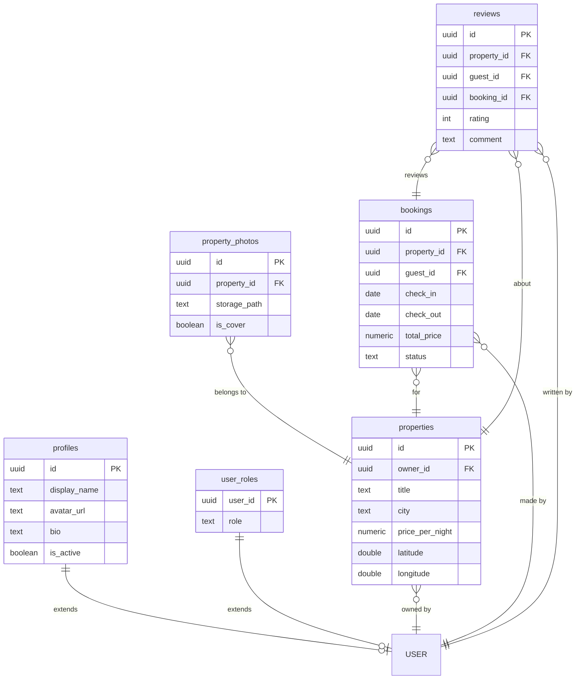

# BookingLife

**Author:** nitsavancheva-ship-it
**Email:** ivelevbg@gmail.com
**GitHub Repo:** https://github.com/nitsavancheva-ship-it/BookingLife
**Live Project URL:** https://bookinglife.netlify.app
**Sample credentials:**
- Guest: `demo.guest@bookinglife.test` / `Demo12345!`
- Admin: `demo.admin@bookinglife.test` / `Demo12345!`

## Project Description

BookingLife is an Airbnb-style property booking platform. Any registered user can browse properties, book a stay, and review a completed stay as a guest — and can also list their own properties as a host (there's no separate "host" role; hosting is just an action available to any signed-in user on their own listings). Admins can manage all users, properties, and bookings across the platform from a dedicated admin panel.

## Architecture

- **Frontend:** Vanilla JavaScript, HTML, CSS, Bootstrap 5, Bootstrap Icons, Leaflet (OpenStreetMap tiles).
- **Build tool:** Vite, configured as a multi-page app — each screen is a separate `.html` entry point.
- **Backend:** Supabase — Postgres database, Auth (email/password, JWT-based sessions), Storage (photo uploads). No custom server; the frontend talks to Supabase directly, and Row-Level Security enforces all authorization.
- **Deployment:** Netlify, continuous deployment from the `main` branch of this repo.

## Database Schema

## Local Development Setup

1. Clone the repo: `git clone https://github.com/nitsavancheva-ship-it/BookingLife.git`
2. Install dependencies: `npm install`
3. Copy `.env.example` to `.env` and fill in your Supabase project's URL and anon key.
4. Link the local project to your Supabase project: `npx supabase link --project-ref <your-project-ref>`
5. Apply migrations: `npx supabase db push`
6. In the Supabase dashboard, go to Authentication → Providers → Email and turn off "Confirm email".
7. Start the dev server: `npm run dev`

## Key Folders and Files

| Path | Purpose |
|---|---|
| `src/js/services/` | All Supabase queries (properties, bookings, reviews, photos, profiles, roles) |
| `src/js/pages/` | Per-screen DOM wiring, one file per `.html` page |
| `src/js/components/` | Reusable render functions (navbar, property card) |
| `src/js/utils/` | Pure helpers (date math, form validation, toasts, HTML escaping) |
| `src/js/auth.js` | Session and role helpers, route guards |
| `supabase/migrations/` | Versioned SQL schema changes |
| `.github/copilot-instructions.md` | AI dev agent context and conventions |
