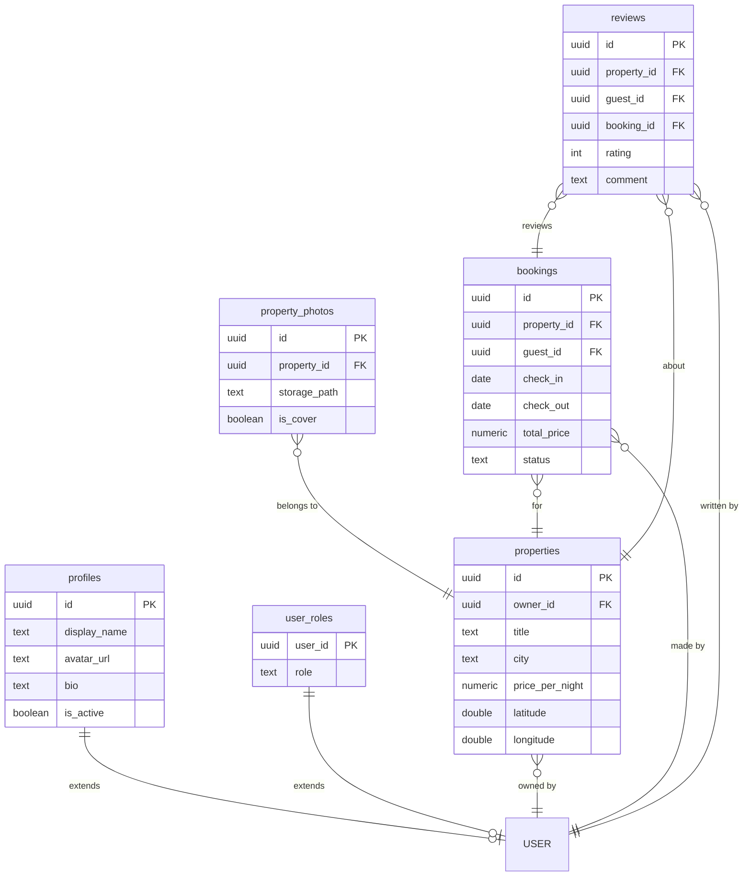

# BookingLife Implementation Plan

> **For agentic workers:** REQUIRED SUB-SKILL: Use superpowers:subagent-driven-development (recommended) or superpowers:executing-plans to implement this plan task-by-task. Steps use checkbox (`- [ ]`) syntax for tracking.

**Goal:** Build and deploy BookingLife, an Airbnb-style property booking platform (Vite multi-page vanilla JS + Bootstrap 5 + Supabase), satisfying every requirement in the SoftUni "Software Technologies with AI" capstone rubric.

**Architecture:** A Vite-built multi-page app (one `.html` entry per screen, one JS module per page) talking directly to Supabase (Postgres + Auth + Storage) via `@supabase/supabase-js`. There is no custom backend server — Row-Level Security in Postgres is the sole authorization layer. Shared code is split into `services/` (Supabase queries only), `pages/` (DOM wiring only), `components/` (reusable render functions), and `utils/` (pure functions).

**Tech Stack:** Vite, vanilla JavaScript (ES modules), Bootstrap 5 (npm), Bootstrap Icons, Leaflet + OpenStreetMap, Supabase (Postgres, Auth, Storage), Netlify.

**Reference spec:** [docs/superpowers/specs/2026-07-11-bookinglife-design.md](../specs/2026-07-11-bookinglife-design.md)

## Global Constraints

- No TypeScript. No React, Vue, or any UI framework — vanilla JS + HTML + CSS + Bootstrap 5 only.
- No custom backend server. All data access goes through Supabase via `@supabase/supabase-js`; RLS enforces authorization, not application code.
- Multi-page app: every screen is its own `.html` file at the project root, registered in `vite.config.js`'s `build.rollupOptions.input`.
- `src/js/services/*.js` are the only files that call `supabase.from(...)` or `supabase.storage.*`.
- Testing approach for this project is **manual verification only** (no automated test framework) — each task is verified by running `npm run dev` and exercising the feature in the browser, per the project's design spec.
- Every task's final step is `git add` → `git commit` → **`git push`** — nothing is left unpushed, since GitHub commit history (with commits on ≥3 different days) is directly graded.
- Work happens directly on `main` — no branches/PRs (optional in the assignment, not worth the overhead here).
- GitHub repo already exists: `https://github.com/nitsavancheva-ship-it/BookingLife` (owner `nitsavancheva-ship-it`).
- Timeline: Day 1 = 2026-07-11, Day 2 = 2026-07-12, Day 3 = 2026-07-13. (Deadline is 2026-07-14 — that day is an unscheduled buffer, not a required work day.)

---

## Day 1 (2026-07-11) — Foundation: scaffolding, database, auth

### Task 1: Project scaffolding

**Files:**
- Create: `package.json`, `vite.config.js`, `.gitignore`, `.env.example`, `netlify.toml`
- Create: `index.html` (placeholder), `src/css/main.css`, `src/js/theme.js`, `src/js/utils/toast.js`

**Interfaces:**
- Consumes: nothing (first task).
- Produces: `showToast(message, type = 'success')` from `src/js/utils/toast.js`, used by every later page script. `theme.js` has no exports — it's imported once per page for its side effects (loads Bootstrap CSS/JS, icons, custom CSS).

- [ ] **Step 1: Create `package.json`**

```json
{
  "name": "bookinglife",
  "private": true,
  "version": "1.0.0",
  "type": "module",
  "scripts": {
    "dev": "vite",
    "build": "vite build",
    "preview": "vite preview"
  },
  "dependencies": {
    "@supabase/supabase-js": "^2.45.0",
    "bootstrap": "^5.3.3",
    "bootstrap-icons": "^1.11.3",
    "leaflet": "^1.9.4"
  },
  "devDependencies": {
    "vite": "^5.4.0",
    "supabase": "^1.200.3"
  }
}
```

- [ ] **Step 2: Install dependencies**

Run: `npm install`
Expected: `node_modules/` populated, no errors.

- [ ] **Step 3: Create `vite.config.js`**

All nine screens plus the 404 page are registered here now, even though most of the referenced `.html` files don't exist yet (they're created in later tasks). `npm run dev` doesn't need these entries — only `npm run build` does, and that isn't run until Day 3's deployment task, by which point every file exists.

```js
import { defineConfig } from 'vite';
import { resolve } from 'path';

export default defineConfig({
  build: {
    rollupOptions: {
      input: {
        main: resolve(__dirname, 'index.html'),
        login: resolve(__dirname, 'login.html'),
        register: resolve(__dirname, 'register.html'),
        property: resolve(__dirname, 'property.html'),
        propertyEdit: resolve(__dirname, 'property-edit.html'),
        myBookings: resolve(__dirname, 'my-bookings.html'),
        myProperties: resolve(__dirname, 'my-properties.html'),
        profile: resolve(__dirname, 'profile.html'),
        admin: resolve(__dirname, 'admin.html'),
        notFound: resolve(__dirname, '404.html'),
      },
    },
  },
});
```

- [ ] **Step 4: Create `.gitignore`**

```
node_modules
dist
.env
.DS_Store
```

- [ ] **Step 5: Create `.env.example`**

```
VITE_SUPABASE_URL=https://your-project-ref.supabase.co
VITE_SUPABASE_ANON_KEY=your-anon-key-here
```

- [ ] **Step 6: Create `netlify.toml`**

```toml
[build]
  command = "npm run build"
  publish = "dist"
```

- [ ] **Step 7: Create `src/css/main.css`**

```css
.property-card {
  transition: transform 0.15s ease, box-shadow 0.15s ease;
}

.property-card:hover {
  transform: translateY(-4px);
  box-shadow: 0 0.5rem 1rem rgba(0, 0, 0, 0.15) !important;
}

body {
  min-height: 100vh;
  display: flex;
  flex-direction: column;
}

main {
  flex: 1;
}
```

- [ ] **Step 8: Create `src/js/theme.js`**

Every page script imports this first, for its side effects (Bootstrap CSS/JS registers its data-attribute-driven components like the navbar collapse toggle, carousel, tabs, and modals).

```js
import 'bootstrap/dist/css/bootstrap.min.css';
import 'bootstrap-icons/font/bootstrap-icons.css';
import 'bootstrap';
import '../css/main.css';
```

- [ ] **Step 9: Create `src/js/utils/toast.js`**

```js
import { Toast } from 'bootstrap';

export function showToast(message, type = 'success') {
  let container = document.getElementById('toast-container');
  if (!container) {
    container = document.createElement('div');
    container.id = 'toast-container';
    container.className = 'toast-container position-fixed bottom-0 end-0 p-3';
    container.style.zIndex = '1080';
    document.body.appendChild(container);
  }

  const toastEl = document.createElement('div');
  toastEl.className = `toast align-items-center text-bg-${type === 'error' ? 'danger' : 'success'} border-0`;
  toastEl.setAttribute('role', 'alert');
  toastEl.innerHTML = `
    <div class="d-flex">
      <div class="toast-body">${message}</div>
      <button type="button" class="btn-close btn-close-white me-2 m-auto" data-bs-dismiss="toast"></button>
    </div>
  `;
  container.appendChild(toastEl);

  const bsToast = new Toast(toastEl, { delay: 4000 });
  bsToast.show();
  toastEl.addEventListener('hidden.bs.toast', () => toastEl.remove());
}
```

- [ ] **Step 10: Create placeholder `index.html`**

```html
<!doctype html>
<html lang="en">
<head>
  <meta charset="UTF-8" />
  <meta name="viewport" content="width=device-width, initial-scale=1.0" />
  <title>BookingLife</title>
</head>
<body>
  <div id="navbar"></div>
  <main class="container my-5">
    <h1>BookingLife scaffold is working.</h1>
  </main>
  <script type="module">
    import '../src/js/theme.js';
  </script>
</body>
</html>
```

- [ ] **Step 11: Verify the dev server boots**

Run: `npm run dev`
Expected: server starts on `http://localhost:5173`; opening it in a browser shows "BookingLife scaffold is working." with Bootstrap's default font applied (confirms Bootstrap CSS loaded).

- [ ] **Step 12: Initialize git, connect to the existing GitHub repo, and push**

```bash
git init
git branch -M main
git remote add origin https://github.com/nitsavancheva-ship-it/BookingLife.git
git add .
git commit -m "chore: scaffold Vite multi-page project with Bootstrap, Leaflet, Supabase client deps"
git push -u origin main
```

---

### Task 2: Agent instructions for AI-assisted development

**Files:**
- Create: `.github/copilot-instructions.md`

**Interfaces:**
- Consumes: nothing.
- Produces: nothing consumed programmatically — this is context for the AI dev agent, referenced only by humans/agents reading it.

- [ ] **Step 1: Create `.github/copilot-instructions.md`**

```markdown
# Copilot Instructions — BookingLife

BookingLife is an Airbnb-style property booking platform built for the SoftUni "Software Technologies with AI" capstone.

## Hard constraints
- No TypeScript. No React, Vue, or any UI framework. Vanilla JS + HTML + CSS + Bootstrap 5 only.
- No custom backend server. All data access goes through Supabase (Postgres + Auth + Storage) via `@supabase/supabase-js`.
- Multi-page app: every screen is its own `.html` file at the project root, not a client-side route.

## File organization
- `src/js/services/*.js` — the ONLY files that call `supabase.from(...)` or `supabase.storage`. No UI code here.
- `src/js/pages/*.js` — one per screen, owns DOM wiring for that screen, calls services/components. No direct Supabase calls.
- `src/js/components/*.js` — reusable render functions (navbar, property card), shared across pages.
- `src/js/utils/*.js` — pure functions only (date math, validation, toasts). No Supabase calls, minimal DOM coupling.
- `src/js/auth.js` — session/role helpers (`requireAuth`, `requireRole`, `getCurrentUser`, `getCurrentRole`, `logout`).

## Adding a new screen
1. Create `new-page.html` at the project root, following the existing skeleton (`<div id="navbar"></div>` + `<main>` + `<script type="module" src="/src/js/pages/newPage.js">`).
2. Create `src/js/pages/newPage.js`.
3. Register the new HTML file in `vite.config.js`'s `build.rollupOptions.input` — otherwise it silently won't be included in the production build (it still works in `npm run dev`, which is the trap).
4. Add a navbar link in `src/js/components/navbar.js` if the page should be reachable from navigation.

## Security
- Row-Level Security (RLS) is the real authorization boundary. Every table has RLS enabled.
- Client-side guards (`requireAuth`, `requireRole`) are UX only — they prevent a flash of protected content, but are never the only check. Any new table or policy must enforce access control in Postgres, not just in a page script.
- Never expose the Supabase service-role key to the client. Only the anon key belongs in `.env` / `import.meta.env`.

## Database changes
- Always add a new file under `supabase/migrations/` for schema changes (`npx supabase migration new <name>`). Never edit the schema directly in the Supabase dashboard — the local `supabase/migrations/` folder must stay the source of truth.
```

- [ ] **Step 2: Commit and push**

```bash
git add .github/copilot-instructions.md
git commit -m "docs: add AI dev agent instructions"
git push
```

---

### Task 3: Supabase project setup + `profiles`/`user_roles` migration

**Files:**
- Create: `supabase/migrations/<timestamp>_profiles_and_roles.sql` (timestamp auto-generated by the CLI)

**Interfaces:**
- Consumes: nothing.
- Produces: tables `public.profiles`, `public.user_roles`; helper functions `public.is_admin(uid uuid) returns boolean` and `public.is_active_user(uid uuid) returns boolean`, used by every later migration's RLS policies; trigger `handle_new_user` that auto-populates both tables on signup.

- [ ] **Step 1: Create a Supabase project (manual, in your Supabase account)**

Go to [supabase.com/dashboard](https://supabase.com/dashboard) → New Project. Name it `bookinglife`, choose a region, set a database password (save it somewhere safe). Once provisioned, copy the **Project URL** and **anon public key** from Project Settings → API — you'll need them for `.env` in Step 4.

- [ ] **Step 2: Install the Supabase CLI as a dev dependency and initialize**

```bash
npx supabase init
```

Expected: creates a `supabase/` folder with `config.toml`.

- [ ] **Step 3: Log in and link the CLI to your project (manual, interactive)**

```bash
npx supabase login
npx supabase link --project-ref <your-project-ref>
```

`<your-project-ref>` is the id in your project's dashboard URL (`https://supabase.com/dashboard/project/<ref>`). This will prompt for your database password from Step 1.

- [ ] **Step 4: Create your local `.env`**

Copy `.env.example` to `.env` and fill in the real `VITE_SUPABASE_URL` and `VITE_SUPABASE_ANON_KEY` from Step 1. This file is gitignored — it is never committed.

- [ ] **Step 5: Generate the first migration file**

```bash
npx supabase migration new profiles_and_roles
```

Expected: creates `supabase/migrations/<timestamp>_profiles_and_roles.sql`.

- [ ] **Step 6: Paste this SQL into the generated file**

```sql
create table public.profiles (
  id uuid primary key references auth.users(id) on delete cascade,
  display_name text,
  avatar_url text,
  bio text,
  is_active boolean not null default true,
  created_at timestamptz not null default now()
);

create table public.user_roles (
  user_id uuid primary key references auth.users(id) on delete cascade,
  role text not null default 'user' check (role in ('user', 'admin'))
);

-- Security-definer helper functions. These run with the privileges of their
-- owner (the migration role, which bypasses RLS), which is what lets a
-- policy on user_roles check "is this caller an admin?" by querying
-- user_roles itself without triggering infinite recursion through its own
-- RLS policies.
create or replace function public.is_admin(uid uuid)
returns boolean
language sql
security definer
set search_path = public
stable
as $$
  select exists (
    select 1 from public.user_roles
    where user_roles.user_id = uid and role = 'admin'
  );
$$;

create or replace function public.is_active_user(uid uuid)
returns boolean
language sql
security definer
set search_path = public
stable
as $$
  select coalesce((select is_active from public.profiles where id = uid), false);
$$;

alter table public.profiles enable row level security;
alter table public.user_roles enable row level security;

create policy "profiles are viewable by everyone"
  on public.profiles for select
  using (true);

create policy "users can update own profile"
  on public.profiles for update
  using (auth.uid() = id);

create policy "admins can update any profile"
  on public.profiles for update
  using (public.is_admin(auth.uid()));

create policy "users can view own role"
  on public.user_roles for select
  using (auth.uid() = user_id);

create policy "admins can view all roles"
  on public.user_roles for select
  using (public.is_admin(auth.uid()));

create policy "admins can update roles"
  on public.user_roles for update
  using (public.is_admin(auth.uid()));

-- Auto-create profile + role rows for every new auth user.
create function public.handle_new_user()
returns trigger
language plpgsql
security definer
set search_path = public
as $$
begin
  insert into public.profiles (id, display_name)
  values (new.id, coalesce(new.raw_user_meta_data->>'display_name', split_part(new.email, '@', 1)));

  insert into public.user_roles (user_id, role)
  values (new.id, 'user');

  return new;
end;
$$;

create trigger on_auth_user_created
  after insert on auth.users
  for each row execute procedure public.handle_new_user();
```

- [ ] **Step 7: Apply the migration**

Run: `npx supabase db push`
Expected: CLI reports the migration applied with no errors. Verify in the Supabase dashboard's Table Editor that `profiles` and `user_roles` tables now exist.

- [ ] **Step 8: Commit and push**

```bash
git add supabase/
git commit -m "feat(db): add profiles and user_roles tables with RBAC helper functions"
git push
```

---

### Task 4: `properties` migration

**Files:**
- Create: `supabase/migrations/<timestamp>_properties.sql`

**Interfaces:**
- Consumes: `public.is_admin(uid)`, `public.is_active_user(uid)` from Task 3.
- Produces: table `public.properties`, trigger `set_updated_at` (reusable — referenced again by name only, not by later migrations).

- [ ] **Step 1: Generate the migration**

Run: `npx supabase migration new properties`

- [ ] **Step 2: Paste this SQL**

```sql
create table public.properties (
  id uuid primary key default gen_random_uuid(),
  owner_id uuid not null references auth.users(id) on delete cascade,
  title text not null,
  description text,
  city text not null,
  address text,
  latitude double precision not null,
  longitude double precision not null,
  price_per_night numeric(10,2) not null check (price_per_night > 0),
  max_guests int not null default 1 check (max_guests > 0),
  bedrooms int not null default 1,
  bathrooms int not null default 1,
  amenities text[] not null default '{}',
  created_at timestamptz not null default now(),
  updated_at timestamptz not null default now()
);

create index properties_city_idx on public.properties (city);
create index properties_owner_id_idx on public.properties (owner_id);
create index properties_price_idx on public.properties (price_per_night);

alter table public.properties enable row level security;

create policy "properties are viewable by everyone"
  on public.properties for select
  using (true);

create policy "active users can insert own properties"
  on public.properties for insert
  with check (auth.uid() = owner_id and public.is_active_user(auth.uid()));

create policy "owners and admins can update properties"
  on public.properties for update
  using (auth.uid() = owner_id or public.is_admin(auth.uid()));

create policy "owners and admins can delete properties"
  on public.properties for delete
  using (auth.uid() = owner_id or public.is_admin(auth.uid()));

create function public.set_updated_at()
returns trigger
language plpgsql
as $$
begin
  new.updated_at = now();
  return new;
end;
$$;

create trigger properties_set_updated_at
  before update on public.properties
  for each row execute procedure public.set_updated_at();
```

- [ ] **Step 3: Apply and verify**

Run: `npx supabase db push`
Expected: no errors; `properties` table visible in the Table Editor with RLS enabled (shield icon).

- [ ] **Step 4: Commit and push**

```bash
git add supabase/
git commit -m "feat(db): add properties table with indexes and RLS"
git push
```

---

### Task 5: `property_photos` migration

**Files:**
- Create: `supabase/migrations/<timestamp>_property_photos.sql`

**Interfaces:**
- Consumes: `public.is_admin(uid)` (Task 3), `public.properties` (Task 4).
- Produces: table `public.property_photos`.

- [ ] **Step 1: Generate the migration**

Run: `npx supabase migration new property_photos`

- [ ] **Step 2: Paste this SQL**

```sql
create table public.property_photos (
  id uuid primary key default gen_random_uuid(),
  property_id uuid not null references public.properties(id) on delete cascade,
  storage_path text not null,
  display_order int not null default 0,
  is_cover boolean not null default false,
  created_at timestamptz not null default now()
);

create index property_photos_property_id_idx on public.property_photos (property_id);
create unique index property_photos_one_cover_per_property
  on public.property_photos (property_id)
  where is_cover;

alter table public.property_photos enable row level security;

create policy "property photos are viewable by everyone"
  on public.property_photos for select
  using (true);

create policy "owners and admins can insert property photos"
  on public.property_photos for insert
  with check (
    public.is_admin(auth.uid())
    or exists (
      select 1 from public.properties
      where properties.id = property_id and properties.owner_id = auth.uid()
    )
  );

create policy "owners and admins can update property photos"
  on public.property_photos for update
  using (
    public.is_admin(auth.uid())
    or exists (
      select 1 from public.properties
      where properties.id = property_id and properties.owner_id = auth.uid()
    )
  );

create policy "owners and admins can delete property photos"
  on public.property_photos for delete
  using (
    public.is_admin(auth.uid())
    or exists (
      select 1 from public.properties
      where properties.id = property_id and properties.owner_id = auth.uid()
    )
  );
```

- [ ] **Step 3: Apply and verify**

Run: `npx supabase db push`
Expected: no errors; `property_photos` table visible with RLS enabled, and a unique index visible under Database → Indexes.

- [ ] **Step 4: Commit and push**

```bash
git add supabase/
git commit -m "feat(db): add property_photos table with one-cover-per-property constraint"
git push
```

---

### Task 6: `bookings` migration

**Files:**
- Create: `supabase/migrations/<timestamp>_bookings.sql`

**Interfaces:**
- Consumes: `public.is_admin(uid)`, `public.is_active_user(uid)` (Task 3), `public.properties` (Task 4).
- Produces: table `public.bookings`, with a GiST exclusion constraint preventing overlapping confirmed bookings for the same property.

- [ ] **Step 1: Generate the migration**

Run: `npx supabase migration new bookings`

- [ ] **Step 2: Paste this SQL**

```sql
create extension if not exists btree_gist;

create table public.bookings (
  id uuid primary key default gen_random_uuid(),
  property_id uuid not null references public.properties(id) on delete cascade,
  guest_id uuid not null references auth.users(id) on delete cascade,
  check_in date not null,
  check_out date not null check (check_out > check_in),
  total_price numeric(10,2) not null check (total_price > 0),
  status text not null default 'confirmed' check (status in ('confirmed', 'cancelled')),
  created_at timestamptz not null default now(),
  exclude using gist (
    property_id with =,
    daterange(check_in, check_out) with &&
  ) where (status = 'confirmed')
);

create index bookings_property_id_idx on public.bookings (property_id);
create index bookings_guest_id_idx on public.bookings (guest_id);

alter table public.bookings enable row level security;

create policy "guests owners and admins can view bookings"
  on public.bookings for select
  using (
    auth.uid() = guest_id
    or public.is_admin(auth.uid())
    or exists (
      select 1 from public.properties
      where properties.id = property_id and properties.owner_id = auth.uid()
    )
  );

create policy "active users can create own bookings"
  on public.bookings for insert
  with check (auth.uid() = guest_id and public.is_active_user(auth.uid()));

create policy "guests owners and admins can update bookings"
  on public.bookings for update
  using (
    auth.uid() = guest_id
    or public.is_admin(auth.uid())
    or exists (
      select 1 from public.properties
      where properties.id = property_id and properties.owner_id = auth.uid()
    )
  );
```

- [ ] **Step 3: Apply and verify**

Run: `npx supabase db push`
Expected: no errors (confirms `btree_gist` installed and the exclusion constraint created). In the SQL editor, run a smoke test:

```sql
insert into public.properties (id, owner_id, title, city, latitude, longitude, price_per_night)
values ('00000000-0000-0000-0000-000000000001', (select id from auth.users limit 1), 'Test', 'Test City', 0, 0, 100);

insert into public.bookings (property_id, guest_id, check_in, check_out, total_price)
values ('00000000-0000-0000-0000-000000000001', (select id from auth.users limit 1), '2026-08-01', '2026-08-05', 400);

-- This second insert with overlapping dates must fail with an exclusion_violation error:
insert into public.bookings (property_id, guest_id, check_in, check_out, total_price)
values ('00000000-0000-0000-0000-000000000001', (select id from auth.users limit 1), '2026-08-03', '2026-08-06', 300);

-- Clean up the smoke test:
delete from public.properties where id = '00000000-0000-0000-0000-000000000001';
```

(This requires at least one row in `auth.users` — sign up any test account first if the project is brand new.)

- [ ] **Step 4: Commit and push**

```bash
git add supabase/
git commit -m "feat(db): add bookings table with DB-enforced no-overlap exclusion constraint"
git push
```

---

### Task 7: `reviews` migration

**Files:**
- Create: `supabase/migrations/<timestamp>_reviews.sql`

**Interfaces:**
- Consumes: `public.is_admin(uid)` (Task 3), `public.properties` (Task 4), `public.bookings` (Task 6).
- Produces: table `public.reviews`.

- [ ] **Step 1: Generate the migration**

Run: `npx supabase migration new reviews`

- [ ] **Step 2: Paste this SQL**

```sql
create table public.reviews (
  id uuid primary key default gen_random_uuid(),
  property_id uuid not null references public.properties(id) on delete cascade,
  guest_id uuid not null references auth.users(id) on delete cascade,
  booking_id uuid not null unique references public.bookings(id) on delete cascade,
  rating int not null check (rating between 1 and 5),
  comment text,
  created_at timestamptz not null default now()
);

create index reviews_property_id_idx on public.reviews (property_id);
create index reviews_guest_id_idx on public.reviews (guest_id);

alter table public.reviews enable row level security;

create policy "reviews are viewable by everyone"
  on public.reviews for select
  using (true);

create policy "guests can review their completed bookings"
  on public.reviews for insert
  with check (
    auth.uid() = guest_id
    and exists (
      select 1 from public.bookings
      where bookings.id = booking_id
        and bookings.guest_id = auth.uid()
        and bookings.status = 'confirmed'
        and bookings.check_out < current_date
    )
  );

create policy "authors and admins can update reviews"
  on public.reviews for update
  using (auth.uid() = guest_id or public.is_admin(auth.uid()));

create policy "authors and admins can delete reviews"
  on public.reviews for delete
  using (auth.uid() = guest_id or public.is_admin(auth.uid()));
```

- [ ] **Step 3: Apply and verify**

Run: `npx supabase db push`
Expected: no errors; `reviews` table visible with RLS enabled and a unique constraint on `booking_id`.

- [ ] **Step 4: Commit and push**

```bash
git add supabase/
git commit -m "feat(db): add reviews table, restricted to completed bookings"
git push
```

---

### Task 8: Storage buckets + policies, disable email confirmation

**Files:**
- Create: `supabase/migrations/<timestamp>_storage.sql`

**Interfaces:**
- Consumes: `public.is_admin(uid)` (Task 3), `public.properties` (Task 4).
- Produces: storage buckets `avatars` and `property-photos`, both public-read with path-scoped write policies.

- [ ] **Step 1: Generate the migration**

Run: `npx supabase migration new storage`

- [ ] **Step 2: Paste this SQL**

```sql
insert into storage.buckets (id, name, public)
values ('avatars', 'avatars', true)
on conflict (id) do nothing;

insert into storage.buckets (id, name, public)
values ('property-photos', 'property-photos', true)
on conflict (id) do nothing;

create policy "avatar images are publicly accessible"
  on storage.objects for select
  using (bucket_id = 'avatars');

create policy "users can upload own avatar"
  on storage.objects for insert
  with check (
    bucket_id = 'avatars'
    and (auth.uid())::text = (storage.foldername(name))[1]
  );

create policy "users can update own avatar"
  on storage.objects for update
  using (
    bucket_id = 'avatars'
    and (auth.uid())::text = (storage.foldername(name))[1]
  );

create policy "users can delete own avatar"
  on storage.objects for delete
  using (
    bucket_id = 'avatars'
    and (auth.uid())::text = (storage.foldername(name))[1]
  );

create policy "property photos are publicly accessible"
  on storage.objects for select
  using (bucket_id = 'property-photos');

create policy "owners and admins can upload property photos"
  on storage.objects for insert
  with check (
    bucket_id = 'property-photos'
    and (
      public.is_admin(auth.uid())
      or exists (
        select 1 from public.properties
        where properties.id::text = (storage.foldername(name))[1]
          and properties.owner_id = auth.uid()
      )
    )
  );

create policy "owners and admins can delete property photos from storage"
  on storage.objects for delete
  using (
    bucket_id = 'property-photos'
    and (
      public.is_admin(auth.uid())
      or exists (
        select 1 from public.properties
        where properties.id::text = (storage.foldername(name))[1]
          and properties.owner_id = auth.uid()
      )
    )
  );
```

- [ ] **Step 3: Apply and verify**

Run: `npx supabase db push`
Expected: no errors; Storage section of the dashboard shows both `avatars` and `property-photos` buckets, both marked public.

- [ ] **Step 4: Disable "Confirm email" (manual, dashboard)**

In the Supabase dashboard: Authentication → Providers → Email → turn **off** "Confirm email". This makes registration instant — required for the demo credentials to work without an inbox, and better UX for everyone testing the register flow.

- [ ] **Step 5: Commit and push**

```bash
git add supabase/
git commit -m "feat(db): add avatars and property-photos storage buckets with path-scoped policies"
git push
```

---

### Task 9: Supabase client + auth helpers

**Files:**
- Create: `src/js/supabaseClient.js`, `src/js/auth.js`

**Interfaces:**
- Consumes: `VITE_SUPABASE_URL`, `VITE_SUPABASE_ANON_KEY` from `.env` (Task 3).
- Produces: `supabase` (the client instance, from `supabaseClient.js`) and, from `auth.js`: `getSession()`, `getCurrentUser()`, `getCurrentRole()`, `requireAuth()`, `requireRole(role)`, `logout()`. These six are used by nearly every later page/service file.

- [ ] **Step 1: Create `src/js/supabaseClient.js`**

```js
import { createClient } from '@supabase/supabase-js';

const supabaseUrl = import.meta.env.VITE_SUPABASE_URL;
const supabaseAnonKey = import.meta.env.VITE_SUPABASE_ANON_KEY;

export const supabase = createClient(supabaseUrl, supabaseAnonKey);
```

- [ ] **Step 2: Create `src/js/auth.js`**

```js
import { supabase } from './supabaseClient.js';

export async function getSession() {
  const {
    data: { session },
  } = await supabase.auth.getSession();
  return session;
}

export async function getCurrentUser() {
  const session = await getSession();
  return session ? session.user : null;
}

export async function getCurrentRole() {
  const user = await getCurrentUser();
  if (!user) return null;
  const { data, error } = await supabase
    .from('user_roles')
    .select('role')
    .eq('user_id', user.id)
    .single();
  if (error) return 'user';
  return data.role;
}

export async function requireAuth() {
  const user = await getCurrentUser();
  if (!user) {
    const redirectTo = window.location.pathname + window.location.search;
    window.location.href = `/login.html?redirect=${encodeURIComponent(redirectTo)}`;
    return null;
  }
  return user;
}

export async function requireRole(role) {
  const user = await requireAuth();
  if (!user) return null;
  const currentRole = await getCurrentRole();
  if (currentRole !== role) {
    window.location.href = '/index.html';
    return null;
  }
  return user;
}

export async function logout() {
  await supabase.auth.signOut();
  window.location.href = '/index.html';
}
```

- [ ] **Step 3: Verify in the browser console**

Run: `npm run dev`, open `http://localhost:5173`, open the browser dev console, and paste:

```js
const mod = await import('/src/js/supabaseClient.js');
console.log(mod.supabase);
```

Expected: logs a Supabase client object with no "supabaseUrl is required" error (confirms `.env` is wired correctly).

- [ ] **Step 4: Commit and push**

```bash
git add src/js/supabaseClient.js src/js/auth.js
git commit -m "feat(auth): add Supabase client and session/role guard helpers"
git push
```

---

### Task 10: Shared navbar component

**Files:**
- Create: `src/js/components/navbar.js`

**Interfaces:**
- Consumes: `getCurrentUser()`, `getCurrentRole()`, `logout()` from `src/js/auth.js` (Task 9).
- Produces: `renderNavbar()` — async, no args, no return value; renders into `<div id="navbar"></div>`. Called at the top of every page script from here on.

- [ ] **Step 1: Create `src/js/components/navbar.js`**

```js
import { getCurrentUser, getCurrentRole, logout } from '../auth.js';

export async function renderNavbar() {
  const mount = document.getElementById('navbar');
  if (!mount) return;

  const user = await getCurrentUser();
  const role = user ? await getCurrentRole() : null;

  const loggedOutLinks = `
    <a class="nav-link" href="/login.html">Login</a>
    <a class="nav-link" href="/register.html">Register</a>
  `;

  const loggedInLinks = `
    <a class="nav-link" href="/index.html">Browse</a>
    <a class="nav-link" href="/my-bookings.html">My Bookings</a>
    <a class="nav-link" href="/my-properties.html">My Properties</a>
    <a class="nav-link" href="/profile.html">Profile</a>
    ${role === 'admin' ? '<a class="nav-link" href="/admin.html">Admin</a>' : ''}
    <a class="nav-link" href="#" id="logout-link">Logout</a>
  `;

  mount.innerHTML = `
    <nav class="navbar navbar-expand-lg navbar-dark bg-dark">
      <div class="container">
        <a class="navbar-brand" href="/index.html"><i class="bi bi-house-heart-fill"></i> BookingLife</a>
        <button class="navbar-toggler" type="button" data-bs-toggle="collapse" data-bs-target="#navbarNav">
          <span class="navbar-toggler-icon"></span>
        </button>
        <div class="collapse navbar-collapse" id="navbarNav">
          <div class="navbar-nav ms-auto">
            ${user ? loggedInLinks : loggedOutLinks}
          </div>
        </div>
      </div>
    </nav>
  `;

  const logoutLink = document.getElementById('logout-link');
  if (logoutLink) {
    logoutLink.addEventListener('click', (e) => {
      e.preventDefault();
      logout();
    });
  }
}
```

- [ ] **Step 2: Wire it into the placeholder `index.html`**

Edit `index.html`'s inline script (from Task 1) to call it:

```html
  <script type="module">
    import '../src/js/theme.js';
    import { renderNavbar } from '../src/js/components/navbar.js';
    renderNavbar();
  </script>
```

- [ ] **Step 3: Verify in the browser**

Run: `npm run dev`, open `http://localhost:5173`. Expected: a dark Bootstrap navbar appears at the top with "BookingLife" brand, and Login/Register links (since no one is signed in yet). Resize the window narrow (or use dev tools device mode) and confirm the navbar collapses to a hamburger icon that toggles the menu on click.

- [ ] **Step 4: Commit and push**

```bash
git add src/js/components/navbar.js index.html
git commit -m "feat(ui): add shared responsive navbar component"
git push
```

---

### Task 11: Login page

**Files:**
- Create: `login.html`, `src/js/pages/login.js`
- Modify: `vite.config.js` is already correct (Task 1 already lists `login`).

**Interfaces:**
- Consumes: `renderNavbar()` (Task 10), `supabase` (Task 9), `isValidEmail(email)` — **new**, defined in this task inline since `utils/validators.js` doesn't exist until Task 13; it's moved into `validators.js` and re-exported identically once that file exists, so no behavior changes.

Since `utils/validators.js` is scheduled for Task 13 (Day 2) but login/register need email validation now, this task creates `src/js/utils/validators.js` early with just `isValidEmail` and `isNonEmpty`; Task 13 will extend it with the remaining validators rather than recreate it.

- [ ] **Step 1: Create `src/js/utils/validators.js`**

```js
export function isValidEmail(email) {
  return /^[^\s@]+@[^\s@]+\.[^\s@]+$/.test(email);
}

export function isNonEmpty(value) {
  return typeof value === 'string' && value.trim().length > 0;
}
```

- [ ] **Step 2: Create `login.html`**

```html
<!doctype html>
<html lang="en">
<head>
  <meta charset="UTF-8" />
  <meta name="viewport" content="width=device-width, initial-scale=1.0" />
  <title>BookingLife — Login</title>
</head>
<body>
  <div id="navbar"></div>
  <main class="container my-5">
    <div class="row justify-content-center">
      <div class="col-md-5">
        <div class="card shadow-sm">
          <div class="card-body p-4">
            <h2 class="card-title mb-4 text-center"><i class="bi bi-house-heart-fill"></i> Log in</h2>
            <form id="login-form" novalidate>
              <div class="mb-3">
                <label for="email" class="form-label">Email</label>
                <input type="email" class="form-control" id="email" required />
                <div class="invalid-feedback">Please enter a valid email.</div>
              </div>
              <div class="mb-3">
                <label for="password" class="form-label">Password</label>
                <input type="password" class="form-control" id="password" required minlength="6" />
                <div class="invalid-feedback">Password must be at least 6 characters.</div>
              </div>
              <div id="form-error" class="alert alert-danger d-none"></div>
              <button type="submit" class="btn btn-primary w-100">Log in</button>
            </form>
            <p class="text-center mt-3 mb-0">No account? <a href="/register.html">Register</a></p>
          </div>
        </div>
      </div>
    </div>
  </main>
  <script type="module" src="/src/js/pages/login.js"></script>
</body>
</html>
```

- [ ] **Step 3: Create `src/js/pages/login.js`**

```js
import '../theme.js';
import { renderNavbar } from '../components/navbar.js';
import { supabase } from '../supabaseClient.js';
import { isValidEmail } from '../utils/validators.js';

renderNavbar();

const form = document.getElementById('login-form');
const errorBox = document.getElementById('form-error');

form.addEventListener('submit', async (e) => {
  e.preventDefault();
  errorBox.classList.add('d-none');
  form.classList.remove('was-validated');

  const email = document.getElementById('email').value.trim();
  const password = document.getElementById('password').value;

  if (!isValidEmail(email) || password.length < 6) {
    form.classList.add('was-validated');
    return;
  }

  const { error } = await supabase.auth.signInWithPassword({ email, password });
  if (error) {
    errorBox.textContent = error.message;
    errorBox.classList.remove('d-none');
    return;
  }

  const params = new URLSearchParams(window.location.search);
  const redirect = params.get('redirect');
  window.location.href = redirect ? decodeURIComponent(redirect) : '/index.html';
});
```

- [ ] **Step 4: Verify in the browser**

Run: `npm run dev`, open `http://localhost:5173/login.html`. Expected: a centered login card renders. Submitting with an invalid email shows Bootstrap's red invalid-feedback text. Submitting valid-looking but nonexistent credentials shows a red alert with Supabase's error message ("Invalid login credentials").

- [ ] **Step 5: Commit and push**

```bash
git add login.html src/js/pages/login.js src/js/utils/validators.js
git commit -m "feat(auth): add login page with redirect-after-login support"
git push
```

---

### Task 12: Register page

**Files:**
- Create: `register.html`, `src/js/pages/register.js`

**Interfaces:**
- Consumes: `renderNavbar()` (Task 10), `supabase` (Task 9), `isValidEmail`, `isNonEmpty` (Task 11).
- Produces: nothing new consumed elsewhere.

- [ ] **Step 1: Create `register.html`**

```html
<!doctype html>
<html lang="en">
<head>
  <meta charset="UTF-8" />
  <meta name="viewport" content="width=device-width, initial-scale=1.0" />
  <title>BookingLife — Register</title>
</head>
<body>
  <div id="navbar"></div>
  <main class="container my-5">
    <div class="row justify-content-center">
      <div class="col-md-5">
        <div class="card shadow-sm">
          <div class="card-body p-4">
            <h2 class="card-title mb-4 text-center"><i class="bi bi-person-plus"></i> Create account</h2>
            <form id="register-form" novalidate>
              <div class="mb-3">
                <label for="display-name" class="form-label">Display name</label>
                <input type="text" class="form-control" id="display-name" required />
                <div class="invalid-feedback">Please enter a display name.</div>
              </div>
              <div class="mb-3">
                <label for="email" class="form-label">Email</label>
                <input type="email" class="form-control" id="email" required />
                <div class="invalid-feedback">Please enter a valid email.</div>
              </div>
              <div class="mb-3">
                <label for="password" class="form-label">Password</label>
                <input type="password" class="form-control" id="password" required minlength="6" />
                <div class="invalid-feedback">Password must be at least 6 characters.</div>
              </div>
              <div id="form-error" class="alert alert-danger d-none"></div>
              <button type="submit" class="btn btn-primary w-100">Register</button>
            </form>
            <p class="text-center mt-3 mb-0">Already have an account? <a href="/login.html">Log in</a></p>
          </div>
        </div>
      </div>
    </div>
  </main>
  <script type="module" src="/src/js/pages/register.js"></script>
</body>
</html>
```

- [ ] **Step 2: Create `src/js/pages/register.js`**

```js
import '../theme.js';
import { renderNavbar } from '../components/navbar.js';
import { supabase } from '../supabaseClient.js';
import { isValidEmail, isNonEmpty } from '../utils/validators.js';

renderNavbar();

const form = document.getElementById('register-form');
const errorBox = document.getElementById('form-error');

form.addEventListener('submit', async (e) => {
  e.preventDefault();
  errorBox.classList.add('d-none');
  form.classList.remove('was-validated');

  const displayName = document.getElementById('display-name').value.trim();
  const email = document.getElementById('email').value.trim();
  const password = document.getElementById('password').value;

  if (!isNonEmpty(displayName) || !isValidEmail(email) || password.length < 6) {
    form.classList.add('was-validated');
    return;
  }

  const { error } = await supabase.auth.signUp({
    email,
    password,
    options: { data: { display_name: displayName } },
  });

  if (error) {
    errorBox.textContent = error.message;
    errorBox.classList.remove('d-none');
    return;
  }

  window.location.href = '/index.html';
});
```

- [ ] **Step 3: Verify end-to-end against the real Supabase project**

Run: `npm run dev`, open `http://localhost:5173/register.html`, register with a real-looking test email (e.g. `test1@example.com`) and a password. Expected: instant redirect to `/index.html` with no email-confirmation prompt (confirms Task 8's "Confirm email" toggle worked), and the navbar now shows Browse/My Bookings/My Properties/Profile/Logout instead of Login/Register. In the Supabase dashboard's Table Editor, confirm a matching row now exists in both `profiles` (with the display name) and `user_roles` (with `role = 'user'`) — this confirms the `handle_new_user` trigger from Task 3 fired correctly.

- [ ] **Step 4: Commit and push**

```bash
git add register.html src/js/pages/register.js
git commit -m "feat(auth): add registration page, verified against live trigger-created profile/role rows"
git push
```

---

## Day 2 (2026-07-12) — Browsing & hosting

### Task 13: Date and remaining form-validation utilities

**Files:**
- Create: `src/js/utils/dates.js`
- Modify: `src/js/utils/validators.js` (add `isPositiveNumber`, `isValidDateRange` to the file created in Task 11)

**Interfaces:**
- Consumes: nothing.
- Produces: `nightsBetween(checkIn, checkOut)`, `calculateTotalPrice(pricePerNight, checkIn, checkOut)`, `formatDate(dateStr)`, `todayISO()` from `dates.js`; `isPositiveNumber(value)`, `isValidDateRange(checkIn, checkOut)` added to `validators.js`. All six are used across Tasks 18-23.

- [ ] **Step 1: Create `src/js/utils/dates.js`**

```js
export function nightsBetween(checkIn, checkOut) {
  const start = new Date(checkIn);
  const end = new Date(checkOut);
  const msPerNight = 1000 * 60 * 60 * 24;
  return Math.round((end - start) / msPerNight);
}

export function calculateTotalPrice(pricePerNight, checkIn, checkOut) {
  const nights = nightsBetween(checkIn, checkOut);
  return Math.round(pricePerNight * nights * 100) / 100;
}

export function formatDate(dateStr) {
  return new Date(dateStr).toLocaleDateString(undefined, {
    year: 'numeric',
    month: 'short',
    day: 'numeric',
  });
}

export function todayISO() {
  return new Date().toISOString().split('T')[0];
}
```

- [ ] **Step 2: Add the remaining validators to `src/js/utils/validators.js`**

Append to the existing file (do not remove `isValidEmail`/`isNonEmpty` from Task 11):

```js

export function isPositiveNumber(value) {
  const n = Number(value);
  return !Number.isNaN(n) && n > 0;
}

export function isValidDateRange(checkIn, checkOut) {
  if (!checkIn || !checkOut) return false;
  return new Date(checkOut) > new Date(checkIn);
}
```

- [ ] **Step 3: Verify with a scratch check**

Run: `npm run dev`, open the browser console on any page, and paste:

```js
const dates = await import('/src/js/utils/dates.js');
console.log(dates.nightsBetween('2026-08-01', '2026-08-05')); // expect 4
console.log(dates.calculateTotalPrice(100, '2026-08-01', '2026-08-05')); // expect 400
```

Expected: logs `4` then `400`.

- [ ] **Step 4: Commit and push**

```bash
git add src/js/utils/dates.js src/js/utils/validators.js
git commit -m "feat(utils): add date/price calculation and remaining form validators"
git push
```

---

### Task 14: `properties` and `photos` services

**Files:**
- Create: `src/js/services/properties.js`, `src/js/services/photos.js`

**Interfaces:**
- Consumes: `supabase` (Task 9).
- Produces: from `properties.js` — `listProperties(filters)`, `getPropertyById(id)`, `listPropertiesByOwner(ownerId)`, `createProperty(property)`, `updateProperty(id, updates)`, `deleteProperty(id)`, `listCities()`. From `photos.js` — `uploadPropertyPhoto(propertyId, file)`, `getPhotoUrl(storagePath)`, `setCoverPhoto(propertyId, photoId)`, `deletePropertyPhoto(photoId, storagePath)`. Used throughout Day 2 and Day 3 pages.

- [ ] **Step 1: Create `src/js/services/properties.js`**

```js
import { supabase } from '../supabaseClient.js';

export async function listProperties({ city, minPrice, maxPrice, minGuests } = {}) {
  let query = supabase.from('properties').select('*, property_photos(*), reviews(rating)');
  if (city) query = query.eq('city', city);
  if (minPrice) query = query.gte('price_per_night', minPrice);
  if (maxPrice) query = query.lte('price_per_night', maxPrice);
  if (minGuests) query = query.gte('max_guests', minGuests);
  const { data, error } = await query.order('created_at', { ascending: false });
  if (error) throw error;
  return data;
}

export async function getPropertyById(id) {
  const { data, error } = await supabase
    .from('properties')
    .select('*, property_photos(*), profiles:owner_id(display_name, avatar_url)')
    .eq('id', id)
    .single();
  if (error) throw error;
  return data;
}

export async function listPropertiesByOwner(ownerId) {
  const { data, error } = await supabase
    .from('properties')
    .select('*, property_photos(*)')
    .eq('owner_id', ownerId)
    .order('created_at', { ascending: false });
  if (error) throw error;
  return data;
}

export async function createProperty(property) {
  const { data, error } = await supabase.from('properties').insert(property).select().single();
  if (error) throw error;
  return data;
}

export async function updateProperty(id, updates) {
  const { data, error } = await supabase
    .from('properties')
    .update(updates)
    .eq('id', id)
    .select()
    .single();
  if (error) throw error;
  return data;
}

export async function deleteProperty(id) {
  const { error } = await supabase.from('properties').delete().eq('id', id);
  if (error) throw error;
}

export async function listCities() {
  const { data, error } = await supabase.from('properties').select('city');
  if (error) throw error;
  return [...new Set(data.map((row) => row.city))].sort();
}
```

- [ ] **Step 2: Create `src/js/services/photos.js`**

```js
import { supabase } from '../supabaseClient.js';

const BUCKET = 'property-photos';

export async function uploadPropertyPhoto(propertyId, file) {
  const path = `${propertyId}/${Date.now()}-${file.name}`;
  const { error: uploadError } = await supabase.storage.from(BUCKET).upload(path, file);
  if (uploadError) throw uploadError;

  const { data, error } = await supabase
    .from('property_photos')
    .insert({ property_id: propertyId, storage_path: path })
    .select()
    .single();
  if (error) throw error;
  return data;
}

export function getPhotoUrl(storagePath) {
  const { data } = supabase.storage.from(BUCKET).getPublicUrl(storagePath);
  return data.publicUrl;
}

export async function setCoverPhoto(propertyId, photoId) {
  await supabase.from('property_photos').update({ is_cover: false }).eq('property_id', propertyId);
  const { error } = await supabase.from('property_photos').update({ is_cover: true }).eq('id', photoId);
  if (error) throw error;
}

export async function deletePropertyPhoto(photoId, storagePath) {
  await supabase.storage.from(BUCKET).remove([storagePath]);
  const { error } = await supabase.from('property_photos').delete().eq('id', photoId);
  if (error) throw error;
}
```

- [ ] **Step 3: Verify with a scratch check against the live database**

Run: `npm run dev`, sign in as your Task 12 test user in one tab, then in the console:

```js
const { createProperty } = await import('/src/js/services/properties.js');
const { supabase } = await import('/src/js/supabaseClient.js');
const { data: { user } } = await supabase.auth.getUser();
const p = await createProperty({
  owner_id: user.id, title: 'Test Cabin', city: 'Sofia',
  latitude: 42.6977, longitude: 23.3219, price_per_night: 80,
});
console.log(p);
```

Expected: logs the created property row with a generated `id`. Confirm it appears in the Supabase Table Editor's `properties` table.

- [ ] **Step 4: Commit and push**

```bash
git add src/js/services/properties.js src/js/services/photos.js
git commit -m "feat(services): add properties and photos service layer"
git push
```

---

### Task 15: `bookings`, `reviews`, `profiles`, `roles` services

**Files:**
- Create: `src/js/services/bookings.js`, `src/js/services/reviews.js`, `src/js/services/profiles.js`, `src/js/services/roles.js`

**Interfaces:**
- Consumes: `supabase` (Task 9).
- Produces: from `bookings.js` — `createBooking(booking)`, `listMyBookings(userId)`, `listBookingsForProperty(propertyId)`, `listAllBookings()`, `cancelBooking(id)`. From `reviews.js` — `listReviewsForProperty(propertyId)`, `createReview(review)`. From `profiles.js` — `getProfile(userId)`, `updateProfile(userId, updates)`, `uploadAvatar(userId, file)`, `listAllProfiles()`, `setActive(userId, isActive)`. From `roles.js` — `setRole(userId, role)`.

- [ ] **Step 1: Create `src/js/services/bookings.js`**

```js
import { supabase } from '../supabaseClient.js';

export async function createBooking(booking) {
  const { data, error } = await supabase.from('bookings').insert(booking).select().single();
  if (error) throw error;
  return data;
}

export async function listMyBookings(userId) {
  const { data, error } = await supabase
    .from('bookings')
    .select('*, properties(*, property_photos(*)), reviews(*)')
    .eq('guest_id', userId)
    .order('check_in', { ascending: false });
  if (error) throw error;
  return data;
}

export async function listBookingsForProperty(propertyId) {
  const { data, error } = await supabase
    .from('bookings')
    .select('*, profiles:guest_id(display_name)')
    .eq('property_id', propertyId)
    .order('check_in', { ascending: false });
  if (error) throw error;
  return data;
}

export async function listAllBookings() {
  const { data, error } = await supabase
    .from('bookings')
    .select('*, properties(title), profiles:guest_id(display_name)')
    .order('created_at', { ascending: false });
  if (error) throw error;
  return data;
}

export async function cancelBooking(id) {
  const { error } = await supabase.from('bookings').update({ status: 'cancelled' }).eq('id', id);
  if (error) throw error;
}
```

- [ ] **Step 2: Create `src/js/services/reviews.js`**

```js
import { supabase } from '../supabaseClient.js';

export async function listReviewsForProperty(propertyId) {
  const { data, error } = await supabase
    .from('reviews')
    .select('*, profiles:guest_id(display_name, avatar_url)')
    .eq('property_id', propertyId)
    .order('created_at', { ascending: false });
  if (error) throw error;
  return data;
}

export async function createReview(review) {
  const { data, error } = await supabase.from('reviews').insert(review).select().single();
  if (error) throw error;
  return data;
}
```

- [ ] **Step 3: Create `src/js/services/profiles.js`**

```js
import { supabase } from '../supabaseClient.js';

export async function getProfile(userId) {
  const { data, error } = await supabase.from('profiles').select('*').eq('id', userId).single();
  if (error) throw error;
  return data;
}

export async function updateProfile(userId, updates) {
  const { data, error } = await supabase
    .from('profiles')
    .update(updates)
    .eq('id', userId)
    .select()
    .single();
  if (error) throw error;
  return data;
}

export async function uploadAvatar(userId, file) {
  const path = `${userId}/${Date.now()}-${file.name}`;
  const { error: uploadError } = await supabase.storage.from('avatars').upload(path, file);
  if (uploadError) throw uploadError;
  const { data } = supabase.storage.from('avatars').getPublicUrl(path);
  return updateProfile(userId, { avatar_url: data.publicUrl });
}

export async function listAllProfiles() {
  const { data, error } = await supabase
    .from('profiles')
    .select('*, user_roles(role)')
    .order('created_at', { ascending: false });
  if (error) throw error;
  return data;
}

export async function setActive(userId, isActive) {
  return updateProfile(userId, { is_active: isActive });
}
```

- [ ] **Step 4: Create `src/js/services/roles.js`**

```js
import { supabase } from '../supabaseClient.js';

export async function setRole(userId, role) {
  const { error } = await supabase.from('user_roles').update({ role }).eq('user_id', userId);
  if (error) throw error;
}
```

- [ ] **Step 5: Verify with a scratch check**

Using the `Test Cabin` property created in Task 14's verification, in the browser console (still signed in):

```js
const { createBooking, listMyBookings } = await import('/src/js/services/bookings.js');
const { supabase } = await import('/src/js/supabaseClient.js');
const { data: { user } } = await supabase.auth.getUser();
await createBooking({ property_id: '<the Test Cabin id from Task 14>', guest_id: user.id, check_in: '2026-09-01', check_out: '2026-09-03', total_price: 160 });
console.log(await listMyBookings(user.id));
```

Expected: logs an array containing the booking, with the nested `properties` object populated (confirms the join in `listMyBookings` works).

- [ ] **Step 6: Commit and push**

```bash
git add src/js/services/bookings.js src/js/services/reviews.js src/js/services/profiles.js src/js/services/roles.js
git commit -m "feat(services): add bookings, reviews, profiles, and roles service layer"
git push
```

---

### Task 16: Property card component

**Files:**
- Create: `src/js/components/propertyCard.js`

**Interfaces:**
- Consumes: `getPhotoUrl(storagePath)` (Task 14).
- Produces: `renderPropertyCard(property)` — returns an HTML string for one Bootstrap card; `property` must include `property_photos` and `reviews` arrays as returned by `listProperties()` (Task 14).

- [ ] **Step 1: Create `src/js/components/propertyCard.js`**

```js
import { getPhotoUrl } from '../services/photos.js';

function averageRating(reviews) {
  if (!reviews || reviews.length === 0) return null;
  const sum = reviews.reduce((acc, r) => acc + r.rating, 0);
  return (sum / reviews.length).toFixed(1);
}

export function renderPropertyCard(property) {
  const cover = property.property_photos?.find((p) => p.is_cover) || property.property_photos?.[0];
  const imageUrl = cover ? getPhotoUrl(cover.storage_path) : 'https://placehold.co/400x300?text=No+Photo';
  const rating = averageRating(property.reviews);

  return `
    <div class="col-md-6">
      <a href="/property.html?id=${property.id}" class="text-decoration-none text-body">
        <div class="card h-100 property-card shadow-sm">
          
          <div class="card-body">
            <h5 class="card-title">${property.title}</h5>
            <p class="card-text text-muted mb-1"><i class="bi bi-geo-alt"></i> ${property.city}</p>
            <p class="card-text fw-bold mb-1">$${property.price_per_night} <span class="fw-normal text-muted">/ night</span></p>
            ${rating ? `<p class="card-text"><i class="bi bi-star-fill text-warning"></i> ${rating}</p>` : '<p class="card-text text-muted small">No reviews yet</p>'}
          </div>
        </div>
      </a>
    </div>
  `;
}
```

- [ ] **Step 2: Commit and push**

Verification happens as part of Task 17, which is the first consumer of this component.

```bash
git add src/js/components/propertyCard.js
git commit -m "feat(ui): add reusable property card component"
git push
```

---

### Task 17: Browse page (index.html)

**Files:**
- Modify: `index.html` (replace Task 1's placeholder content)
- Create: `src/js/pages/browse.js`

**Interfaces:**
- Consumes: `renderNavbar()` (Task 10), `listProperties(filters)`, `listCities()` (Task 14), `renderPropertyCard(property)` (Task 16), `showToast` (Task 1).
- Produces: nothing new consumed elsewhere.

- [ ] **Step 1: Replace `index.html`'s `<body>` content**

```html
<!doctype html>
<html lang="en">
<head>
  <meta charset="UTF-8" />
  <meta name="viewport" content="width=device-width, initial-scale=1.0" />
  <title>BookingLife — Browse Properties</title>
</head>
<body>
  <div id="navbar"></div>
  <main class="container my-4">
    <h1 class="mb-4"><i class="bi bi-compass"></i> Find your next stay</h1>

    <form id="filter-form" class="row g-2 mb-4">
      <div class="col-md-3">
        <select id="filter-city" class="form-select">
          <option value="">All cities</option>
        </select>
      </div>
      <div class="col-md-2">
        <input type="number" id="filter-min-price" class="form-control" placeholder="Min price" min="0" />
      </div>
      <div class="col-md-2">
        <input type="number" id="filter-max-price" class="form-control" placeholder="Max price" min="0" />
      </div>
      <div class="col-md-2">
        <input type="number" id="filter-guests" class="form-control" placeholder="Guests" min="1" />
      </div>
      <div class="col-md-3">
        <button type="submit" class="btn btn-primary w-100"><i class="bi bi-search"></i> Filter</button>
      </div>
    </form>

    <div class="row">
      <div class="col-lg-6 mb-4">
        <div id="map" style="height: 500px; border-radius: 8px;"></div>
      </div>
      <div class="col-lg-6">
        <div id="loading" class="text-center py-5">
          <div class="spinner-border text-primary" role="status"></div>
        </div>
        <div id="empty-state" class="text-center py-5 d-none">
          <i class="bi bi-house-x display-1 text-muted"></i>
          <p class="text-muted mt-3">No properties match your filters.</p>
        </div>
        <div id="property-list" class="row g-3"></div>
      </div>
    </div>
  </main>
  <script type="module" src="/src/js/pages/browse.js"></script>
</body>
</html>
```

- [ ] **Step 2: Create `src/js/pages/browse.js`**

```js
import '../theme.js';
import 'leaflet/dist/leaflet.css';
import L from 'leaflet';
import { renderNavbar } from '../components/navbar.js';
import { listProperties, listCities } from '../services/properties.js';
import { renderPropertyCard } from '../components/propertyCard.js';
import { showToast } from '../utils/toast.js';

renderNavbar();

let map;
let markers = [];

function initMap() {
  map = L.map('map').setView([42.6977, 23.3219], 6);
  L.tileLayer('https://{s}.tile.openstreetmap.org/{z}/{x}/{y}.png', {
    attribution: '&copy; OpenStreetMap contributors',
  }).addTo(map);
}

function clearMarkers() {
  markers.forEach((m) => map.removeLayer(m));
  markers = [];
}

function plotProperties(properties) {
  clearMarkers();
  properties.forEach((property) => {
    const marker = L.marker([property.latitude, property.longitude]).addTo(map);
    marker.bindPopup(`<a href="/property.html?id=${property.id}">${property.title}</a>`);
    markers.push(marker);
  });
}

async function loadCities() {
  const citySelect = document.getElementById('filter-city');
  const cities = await listCities();
  cities.forEach((city) => {
    const option = document.createElement('option');
    option.value = city;
    option.textContent = city;
    citySelect.appendChild(option);
  });
}

async function loadProperties(filters = {}) {
  const loading = document.getElementById('loading');
  const emptyState = document.getElementById('empty-state');
  const list = document.getElementById('property-list');

  loading.classList.remove('d-none');
  emptyState.classList.add('d-none');
  list.innerHTML = '';

  try {
    const properties = await listProperties(filters);
    loading.classList.add('d-none');

    if (properties.length === 0) {
      emptyState.classList.remove('d-none');
      clearMarkers();
      return;
    }

    properties.forEach((property) => {
      list.insertAdjacentHTML('beforeend', renderPropertyCard(property));
    });
    plotProperties(properties);
  } catch (error) {
    loading.classList.add('d-none');
    showToast('Could not load properties: ' + error.message, 'error');
  }
}

document.getElementById('filter-form').addEventListener('submit', (e) => {
  e.preventDefault();
  loadProperties({
    city: document.getElementById('filter-city').value || undefined,
    minPrice: document.getElementById('filter-min-price').value || undefined,
    maxPrice: document.getElementById('filter-max-price').value || undefined,
    minGuests: document.getElementById('filter-guests').value || undefined,
  });
});

initMap();
loadCities();
loadProperties();
```

- [ ] **Step 3: Verify in the browser**

Run: `npm run dev`, open `http://localhost:5173/`. Expected: a Leaflet map (OpenStreetMap tiles) on the left and, on the right, the `Test Cabin` property card from Task 14 with its city and price. Clicking the map pin shows a popup linking to the property. Typing a min price above 80 and filtering shows the empty state instead. Narrow the browser to mobile width and confirm the map and list stack vertically.

- [ ] **Step 4: Commit and push**

```bash
git add index.html src/js/pages/browse.js
git commit -m "feat(browse): add map+list browse page with city/price/guest filters"
git push
```

---

### Task 18: Property detail page

**Files:**
- Create: `property.html`, `src/js/pages/property.js`

**Interfaces:**
- Consumes: `renderNavbar()` (Task 10), `getCurrentUser()` (Task 9), `getPropertyById(id)` (Task 14), `getPhotoUrl(storagePath)` (Task 14), `listReviewsForProperty(propertyId)` (Task 15), `createBooking(booking)` (Task 15), `nightsBetween`, `calculateTotalPrice`, `todayISO`, `formatDate` (Task 13), `isValidDateRange` (Task 13), `showToast` (Task 1).
- Produces: nothing new consumed elsewhere.

- [ ] **Step 1: Create `property.html`**

```html
<!doctype html>
<html lang="en">
<head>
  <meta charset="UTF-8" />
  <meta name="viewport" content="width=device-width, initial-scale=1.0" />
  <title>BookingLife — Property</title>
</head>
<body>
  <div id="navbar"></div>
  <main class="container my-4">
    <div id="loading" class="text-center py-5">
      <div class="spinner-border text-primary" role="status"></div>
    </div>

    <div id="property-content" class="d-none">
      <div id="carousel" class="carousel slide mb-4">
        <div class="carousel-inner" id="carousel-inner"></div>
        <button class="carousel-control-prev" type="button" data-bs-target="#carousel" data-bs-slide="prev">
          <span class="carousel-control-prev-icon"></span>
        </button>
        <button class="carousel-control-next" type="button" data-bs-target="#carousel" data-bs-slide="next">
          <span class="carousel-control-next-icon"></span>
        </button>
      </div>

      <div class="row">
        <div class="col-lg-7">
          <h1 id="property-title"></h1>
          <p class="text-muted"><i class="bi bi-geo-alt"></i> <span id="property-address"></span></p>
          <div id="property-rating" class="mb-3"></div>
          <div class="d-flex gap-3 mb-3 text-muted">
            <span><i class="bi bi-people"></i> <span id="property-guests"></span> guests</span>
            <span><i class="bi bi-door-closed"></i> <span id="property-bedrooms"></span> bedrooms</span>
            <span><i class="bi bi-droplet"></i> <span id="property-bathrooms"></span> bathrooms</span>
          </div>
          <p id="property-description"></p>
          <div id="property-amenities" class="mb-4 d-flex flex-wrap gap-2"></div>
          <div id="map" style="height: 300px; border-radius: 8px;" class="mb-4"></div>

          <h4><i class="bi bi-person-circle"></i> Hosted by <span id="host-name"></span></h4>

          <hr />
          <h4 class="mt-4">Reviews</h4>
          <div id="reviews-list"></div>
        </div>

        <div class="col-lg-5">
          <div class="card shadow-sm sticky-top" style="top: 1rem;">
            <div class="card-body">
              <h4 class="card-title">$<span id="price-per-night"></span> <span class="fs-6 fw-normal text-muted">/ night</span></h4>
              <div id="booking-widget">
                <form id="booking-form">
                  <div class="row g-2 mb-2">
                    <div class="col-6">
                      <label class="form-label small">Check-in</label>
                      <input type="date" id="check-in" class="form-control" required />
                    </div>
                    <div class="col-6">
                      <label class="form-label small">Check-out</label>
                      <input type="date" id="check-out" class="form-control" required />
                    </div>
                  </div>
                  <div id="price-summary" class="mb-3 d-none">
                    <p class="mb-1"><span id="nights-count"></span> nights &times; $<span id="nightly-rate"></span></p>
                    <p class="fw-bold">Total: $<span id="total-price"></span></p>
                  </div>
                  <div id="booking-error" class="alert alert-danger d-none"></div>
                  <button type="submit" class="btn btn-primary w-100"><i class="bi bi-calendar-check"></i> Book now</button>
                </form>
              </div>
              <div id="login-prompt" class="d-none text-center">
                <p class="text-muted">Log in to book this property.</p>
                <a href="#" id="login-prompt-link" class="btn btn-outline-primary w-100">Log in to book</a>
              </div>
              <div id="owner-notice" class="alert alert-info d-none mt-3 mb-0">This is your own listing.</div>
            </div>
          </div>
        </div>
      </div>
    </div>
  </main>
  <script type="module" src="/src/js/pages/property.js"></script>
</body>
</html>
```

- [ ] **Step 2: Create `src/js/pages/property.js`**

```js
import '../theme.js';
import 'leaflet/dist/leaflet.css';
import L from 'leaflet';
import { renderNavbar } from '../components/navbar.js';
import { getCurrentUser } from '../auth.js';
import { getPropertyById } from '../services/properties.js';
import { getPhotoUrl } from '../services/photos.js';
import { listReviewsForProperty } from '../services/reviews.js';
import { createBooking } from '../services/bookings.js';
import { nightsBetween, calculateTotalPrice, todayISO, formatDate } from '../utils/dates.js';
import { isValidDateRange } from '../utils/validators.js';
import { showToast } from '../utils/toast.js';

renderNavbar();

const params = new URLSearchParams(window.location.search);
const propertyId = params.get('id');

if (!propertyId) {
  window.location.href = '/index.html';
}

function renderAmenities(amenities) {
  const container = document.getElementById('property-amenities');
  (amenities || []).forEach((amenity) => {
    container.insertAdjacentHTML('beforeend', `<span class="badge text-bg-light border"><i class="bi bi-check2"></i> ${amenity}</span>`);
  });
}

function renderCarousel(photos) {
  const inner = document.getElementById('carousel-inner');
  if (!photos || photos.length === 0) {
    inner.innerHTML = `<div class="carousel-item active"></div>`;
    return;
  }
  const sorted = [...photos].sort((a, b) => (b.is_cover ? 1 : 0) - (a.is_cover ? 1 : 0));
  inner.innerHTML = sorted
    .map(
      (photo, index) => `
      <div class="carousel-item ${index === 0 ? 'active' : ''}">
        
      </div>`
    )
    .join('');
}

function renderReviews(reviews) {
  const list = document.getElementById('reviews-list');
  if (reviews.length === 0) {
    list.innerHTML = '<p class="text-muted">No reviews yet.</p>';
    return;
  }
  list.innerHTML = reviews
    .map(
      (review) => `
      <div class="border-bottom py-3">
        <div class="d-flex justify-content-between">
          <strong>${review.profiles?.display_name || 'Guest'}</strong>
          <span class="text-warning">${'★'.repeat(review.rating)}${'☆'.repeat(5 - review.rating)}</span>
        </div>
        <p class="mb-0 text-muted small">${formatDate(review.created_at)}</p>
        <p class="mb-0">${review.comment || ''}</p>
      </div>`
    )
    .join('');

  const ratingHeader = document.getElementById('property-rating');
  const avg = (reviews.reduce((acc, r) => acc + r.rating, 0) / reviews.length).toFixed(1);
  ratingHeader.innerHTML = `<i class="bi bi-star-fill text-warning"></i> ${avg} &middot; ${reviews.length} review${reviews.length === 1 ? '' : 's'}`;
}

function updatePriceSummary(pricePerNight) {
  const checkIn = document.getElementById('check-in').value;
  const checkOut = document.getElementById('check-out').value;
  const summary = document.getElementById('price-summary');

  if (!isValidDateRange(checkIn, checkOut)) {
    summary.classList.add('d-none');
    return;
  }

  const nights = nightsBetween(checkIn, checkOut);
  const total = calculateTotalPrice(pricePerNight, checkIn, checkOut);
  document.getElementById('nights-count').textContent = nights;
  document.getElementById('nightly-rate').textContent = pricePerNight;
  document.getElementById('total-price').textContent = total.toFixed(2);
  summary.classList.remove('d-none');
}

async function init() {
  const property = await getPropertyById(propertyId);
  const reviews = await listReviewsForProperty(propertyId);
  const user = await getCurrentUser();

  document.getElementById('loading').classList.add('d-none');
  document.getElementById('property-content').classList.remove('d-none');

  document.title = `BookingLife — ${property.title}`;
  document.getElementById('property-title').textContent = property.title;
  document.getElementById('property-address').textContent = `${property.address ? property.address + ', ' : ''}${property.city}`;
  document.getElementById('property-guests').textContent = property.max_guests;
  document.getElementById('property-bedrooms').textContent = property.bedrooms;
  document.getElementById('property-bathrooms').textContent = property.bathrooms;
  document.getElementById('property-description').textContent = property.description || '';
  document.getElementById('host-name').textContent = property.profiles?.display_name || 'Host';
  document.getElementById('price-per-night').textContent = property.price_per_night;

  renderAmenities(property.amenities);
  renderCarousel(property.property_photos);
  renderReviews(reviews);

  const map = L.map('map', { scrollWheelZoom: false }).setView([property.latitude, property.longitude], 14);
  L.tileLayer('https://{s}.tile.openstreetmap.org/{z}/{x}/{y}.png', {
    attribution: '&copy; OpenStreetMap contributors',
  }).addTo(map);
  L.marker([property.latitude, property.longitude]).addTo(map);

  const checkInInput = document.getElementById('check-in');
  const checkOutInput = document.getElementById('check-out');
  checkInInput.min = todayISO();
  checkOutInput.min = todayISO();
  checkInInput.addEventListener('change', () => updatePriceSummary(property.price_per_night));
  checkOutInput.addEventListener('change', () => updatePriceSummary(property.price_per_night));

  if (!user) {
    document.getElementById('booking-widget').classList.add('d-none');
    document.getElementById('login-prompt').classList.remove('d-none');
    document.getElementById('login-prompt-link').href = `/login.html?redirect=${encodeURIComponent(window.location.pathname + window.location.search)}`;
  } else if (user.id === property.owner_id) {
    document.getElementById('booking-widget').classList.add('d-none');
    document.getElementById('owner-notice').classList.remove('d-none');
  } else {
    document.getElementById('booking-form').addEventListener('submit', async (e) => {
      e.preventDefault();
      const errorBox = document.getElementById('booking-error');
      errorBox.classList.add('d-none');

      const checkIn = checkInInput.value;
      const checkOut = checkOutInput.value;

      if (!isValidDateRange(checkIn, checkOut)) {
        errorBox.textContent = 'Check-out must be after check-in.';
        errorBox.classList.remove('d-none');
        return;
      }

      try {
        await createBooking({
          property_id: property.id,
          guest_id: user.id,
          check_in: checkIn,
          check_out: checkOut,
          total_price: calculateTotalPrice(property.price_per_night, checkIn, checkOut),
        });
        showToast('Booking confirmed!');
        window.location.href = '/my-bookings.html';
      } catch (error) {
        if (error.code === '23P01') {
          errorBox.textContent = 'Those dates were just booked by someone else. Please pick different dates.';
        } else {
          errorBox.textContent = error.message;
        }
        errorBox.classList.remove('d-none');
      }
    });
  }
}

init();
```

- [ ] **Step 3: Verify in the browser, three scenarios**

Run: `npm run dev`, click into the `Test Cabin` card from Task 17 (or open `/property.html?id=<its id>` directly).

1. **Signed out** (open in a private/incognito window): expect the photo carousel, details, map, and a "Log in to book" button instead of the booking form. Click it — expect redirect to `/login.html?redirect=%2Fproperty.html...`, and after logging in, landing back on this exact property page.
2. **Signed in as a different user**: expect the booking form. Pick a check-in/check-out date and confirm the nights/total price summary updates live. Submit — expect a success toast and redirect to `/my-bookings.html` (empty for now, built in Task 21).
3. **Signed in as the property's own owner**: expect "This is your own listing." instead of a booking form.

Also manually re-submit the same dates from a second browser/incognito session signed in as another user to confirm the "already booked" error path (SQLSTATE `23P01`) surfaces as a friendly toast/alert, not a raw error.

- [ ] **Step 4: Commit and push**

```bash
git add property.html src/js/pages/property.js
git commit -m "feat(property): add property detail page with gallery, map, reviews, and booking widget"
git push
```

---

### Task 19: Create/edit property page

**Files:**
- Create: `property-edit.html`, `src/js/pages/propertyEdit.js`

**Interfaces:**
- Consumes: `renderNavbar()` (Task 10), `requireAuth()`, `getCurrentRole()` (Task 9), `getPropertyById`, `createProperty`, `updateProperty` (Task 14), `uploadPropertyPhoto`, `getPhotoUrl`, `setCoverPhoto`, `deletePropertyPhoto` (Task 14), `isNonEmpty`, `isPositiveNumber` (Tasks 11/13), `showToast` (Task 1).
- Produces: nothing new consumed elsewhere.

- [ ] **Step 1: Create `property-edit.html`**

```html
<!doctype html>
<html lang="en">
<head>
  <meta charset="UTF-8" />
  <meta name="viewport" content="width=device-width, initial-scale=1.0" />
  <title>BookingLife — Edit Property</title>
</head>
<body>
  <div id="navbar"></div>
  <main class="container my-4">
    <h1 id="page-title" class="mb-4"><i class="bi bi-house-add"></i> Add a property</h1>

    <form id="property-form" novalidate>
      <div class="row g-3">
        <div class="col-md-6">
          <label class="form-label">Title</label>
          <input type="text" id="title" class="form-control" required />
        </div>
        <div class="col-md-6">
          <label class="form-label">City</label>
          <input type="text" id="city" class="form-control" required />
        </div>
        <div class="col-12">
          <label class="form-label">Address</label>
          <input type="text" id="address" class="form-control" />
        </div>
        <div class="col-12">
          <label class="form-label">Description</label>
          <textarea id="description" class="form-control" rows="3"></textarea>
        </div>
        <div class="col-md-3">
          <label class="form-label">Price / night ($)</label>
          <input type="number" id="price" class="form-control" min="1" step="0.01" required />
        </div>
        <div class="col-md-3">
          <label class="form-label">Max guests</label>
          <input type="number" id="max-guests" class="form-control" min="1" required />
        </div>
        <div class="col-md-3">
          <label class="form-label">Bedrooms</label>
          <input type="number" id="bedrooms" class="form-control" min="0" value="1" />
        </div>
        <div class="col-md-3">
          <label class="form-label">Bathrooms</label>
          <input type="number" id="bathrooms" class="form-control" min="0" value="1" />
        </div>

        <div class="col-12">
          <label class="form-label">Amenities</label>
          <div id="amenities-checkboxes" class="d-flex flex-wrap gap-3"></div>
        </div>

        <div class="col-12">
          <label class="form-label">Location (click the map to place a pin)</label>
          <div id="map" style="height: 300px; border-radius: 8px;"></div>
          <p class="text-muted small mt-1" id="location-hint">No location selected yet.</p>
        </div>

        <div class="col-12">
          <label class="form-label">Photos</label>
          <input type="file" id="photo-input" class="form-control" accept="image/*" multiple />
          <div id="photo-gallery" class="d-flex flex-wrap gap-2 mt-2"></div>
        </div>
      </div>

      <div id="form-error" class="alert alert-danger d-none mt-3"></div>

      <div class="mt-4 d-flex gap-2">
        <button type="submit" class="btn btn-primary"><i class="bi bi-check2"></i> Save property</button>
        <a href="/my-properties.html" class="btn btn-outline-secondary">Cancel</a>
      </div>
    </form>
  </main>
  <script type="module" src="/src/js/pages/propertyEdit.js"></script>
</body>
</html>
```

- [ ] **Step 2: Create `src/js/pages/propertyEdit.js`**

```js
import '../theme.js';
import 'leaflet/dist/leaflet.css';
import L from 'leaflet';
import { renderNavbar } from '../components/navbar.js';
import { requireAuth, getCurrentRole } from '../auth.js';
import { getPropertyById, createProperty, updateProperty } from '../services/properties.js';
import { uploadPropertyPhoto, getPhotoUrl, setCoverPhoto, deletePropertyPhoto } from '../services/photos.js';
import { isNonEmpty, isPositiveNumber } from '../utils/validators.js';
import { showToast } from '../utils/toast.js';

renderNavbar();

const AMENITIES = ['WiFi', 'Kitchen', 'Free Parking', 'Pool', 'Air Conditioning', 'Washer', 'TV', 'Pet Friendly'];

const params = new URLSearchParams(window.location.search);
const propertyId = params.get('id');

let marker = null;
let map = null;
let selectedLat = null;
let selectedLng = null;

function renderAmenityCheckboxes(selected = []) {
  const container = document.getElementById('amenities-checkboxes');
  container.innerHTML = AMENITIES.map(
    (amenity) => `
    <div class="form-check">
      <input class="form-check-input amenity-checkbox" type="checkbox" value="${amenity}" id="amenity-${amenity}" ${selected.includes(amenity) ? 'checked' : ''} />
      <label class="form-check-label" for="amenity-${amenity}">${amenity}</label>
    </div>`
  ).join('');
}

function getSelectedAmenities() {
  return [...document.querySelectorAll('.amenity-checkbox:checked')].map((el) => el.value);
}

function initMap(lat = 42.6977, lng = 23.3219, hasPin = false) {
  map = L.map('map').setView([lat, lng], hasPin ? 13 : 6);
  L.tileLayer('https://{s}.tile.openstreetmap.org/{z}/{x}/{y}.png', {
    attribution: '&copy; OpenStreetMap contributors',
  }).addTo(map);

  if (hasPin) {
    marker = L.marker([lat, lng]).addTo(map);
    selectedLat = lat;
    selectedLng = lng;
    document.getElementById('location-hint').textContent = `Selected: ${lat.toFixed(5)}, ${lng.toFixed(5)}`;
  }

  map.on('click', (e) => {
    selectedLat = e.latlng.lat;
    selectedLng = e.latlng.lng;
    if (marker) {
      marker.setLatLng(e.latlng);
    } else {
      marker = L.marker(e.latlng).addTo(map);
    }
    document.getElementById('location-hint').textContent = `Selected: ${selectedLat.toFixed(5)}, ${selectedLng.toFixed(5)}`;
  });
}

function renderPhotoGallery(photos) {
  const gallery = document.getElementById('photo-gallery');
  gallery.innerHTML = (photos || [])
    .map(
      (photo) => `
      <div class="position-relative" data-photo-id="${photo.id}">
        
        <div class="d-flex gap-1 mt-1">
          <button type="button" class="btn btn-sm btn-outline-primary set-cover-btn" data-photo-id="${photo.id}">Cover</button>
          <button type="button" class="btn btn-sm btn-outline-danger delete-photo-btn" data-photo-id="${photo.id}" data-storage-path="${photo.storage_path}">
            <i class="bi bi-trash"></i>
          </button>
        </div>
      </div>`
    )
    .join('');

  gallery.querySelectorAll('.set-cover-btn').forEach((btn) => {
    btn.addEventListener('click', async () => {
      await setCoverPhoto(propertyId, btn.dataset.photoId);
      const property = await getPropertyById(propertyId);
      renderPhotoGallery(property.property_photos);
      showToast('Cover photo updated.');
    });
  });

  gallery.querySelectorAll('.delete-photo-btn').forEach((btn) => {
    btn.addEventListener('click', async () => {
      await deletePropertyPhoto(btn.dataset.photoId, btn.dataset.storagePath);
      const property = await getPropertyById(propertyId);
      renderPhotoGallery(property.property_photos);
      showToast('Photo deleted.');
    });
  });
}

async function loadExisting(user) {
  const property = await getPropertyById(propertyId);
  const role = await getCurrentRole();

  if (property.owner_id !== user.id && role !== 'admin') {
    window.location.href = '/index.html';
    return;
  }

  document.getElementById('page-title').innerHTML = '<i class="bi bi-pencil-square"></i> Edit property';
  document.getElementById('title').value = property.title;
  document.getElementById('city').value = property.city;
  document.getElementById('address').value = property.address || '';
  document.getElementById('description').value = property.description || '';
  document.getElementById('price').value = property.price_per_night;
  document.getElementById('max-guests').value = property.max_guests;
  document.getElementById('bedrooms').value = property.bedrooms;
  document.getElementById('bathrooms').value = property.bathrooms;

  renderAmenityCheckboxes(property.amenities || []);
  initMap(property.latitude, property.longitude, true);
  renderPhotoGallery(property.property_photos);

  document.getElementById('photo-input').addEventListener('change', async (e) => {
    for (const file of e.target.files) {
      await uploadPropertyPhoto(propertyId, file);
    }
    const updated = await getPropertyById(propertyId);
    renderPhotoGallery(updated.property_photos);
    showToast('Photos uploaded.');
    e.target.value = '';
  });
}

async function init() {
  const user = await requireAuth();
  if (!user) return;

  if (propertyId) {
    await loadExisting(user);
  } else {
    renderAmenityCheckboxes();
    initMap();
    document.getElementById('photo-input').disabled = true;
    document.getElementById('photo-input').title = 'Save the property first, then add photos.';
  }

  document.getElementById('property-form').addEventListener('submit', async (e) => {
    e.preventDefault();
    const errorBox = document.getElementById('form-error');
    errorBox.classList.add('d-none');

    const title = document.getElementById('title').value.trim();
    const city = document.getElementById('city').value.trim();
    const price = document.getElementById('price').value;
    const maxGuests = document.getElementById('max-guests').value;

    if (!isNonEmpty(title) || !isNonEmpty(city) || !isPositiveNumber(price) || !isPositiveNumber(maxGuests)) {
      errorBox.textContent = 'Please fill in title, city, a positive price, and a positive guest count.';
      errorBox.classList.remove('d-none');
      return;
    }

    if (selectedLat === null || selectedLng === null) {
      errorBox.textContent = 'Please click the map to set the property location.';
      errorBox.classList.remove('d-none');
      return;
    }

    const payload = {
      title,
      city,
      address: document.getElementById('address').value.trim(),
      description: document.getElementById('description').value.trim(),
      price_per_night: Number(price),
      max_guests: Number(maxGuests),
      bedrooms: Number(document.getElementById('bedrooms').value || 0),
      bathrooms: Number(document.getElementById('bathrooms').value || 0),
      amenities: getSelectedAmenities(),
      latitude: selectedLat,
      longitude: selectedLng,
    };

    try {
      if (propertyId) {
        await updateProperty(propertyId, payload);
        showToast('Property updated.');
        window.location.href = `/property.html?id=${propertyId}`;
      } else {
        payload.owner_id = user.id;
        const created = await createProperty(payload);
        showToast('Property created. Now add some photos!');
        window.location.href = `/property-edit.html?id=${created.id}`;
      }
    } catch (error) {
      errorBox.textContent = error.message;
      errorBox.classList.remove('d-none');
    }
  });
}

init();
```

- [ ] **Step 3: Verify in the browser, create and edit flows**

Run: `npm run dev`, sign in, open `/property-edit.html`. Expected: form with disabled photo input (no property id yet) and a hint that location isn't set. Click the map — a pin drops and the hint updates with coordinates. Fill in title/city/price/guests, check a couple of amenities, submit. Expected: success toast, redirect to `/property-edit.html?id=<new id>` with the photo input now enabled. Upload 2 images — expect both to appear as 100x100 thumbnails; click "Cover" on one — expect a blue border to move to it. Delete one photo — expect it to disappear from the gallery and from the `property-photos` storage bucket in the Supabase dashboard.

- [ ] **Step 4: Commit and push**

```bash
git add property-edit.html src/js/pages/propertyEdit.js
git commit -m "feat(property): add create/edit property form with map pin picker and photo gallery"
git push
```

---

### Task 20: Host dashboard (My Properties)

**Files:**
- Create: `my-properties.html`, `src/js/pages/myProperties.js`

**Interfaces:**
- Consumes: `renderNavbar()` (Task 10), `requireAuth()` (Task 9), `listPropertiesByOwner`, `deleteProperty` (Task 14), `listBookingsForProperty` (Task 15), `getPhotoUrl` (Task 14), `formatDate` (Task 13), `showToast` (Task 1).
- Produces: nothing new consumed elsewhere.

- [ ] **Step 1: Create `my-properties.html`**

```html
<!doctype html>
<html lang="en">
<head>
  <meta charset="UTF-8" />
  <meta name="viewport" content="width=device-width, initial-scale=1.0" />
  <title>BookingLife — My Properties</title>
</head>
<body>
  <div id="navbar"></div>
  <main class="container my-4">
    <div class="d-flex justify-content-between align-items-center mb-4">
      <h1><i class="bi bi-houses"></i> My Properties</h1>
      <a href="/property-edit.html" class="btn btn-primary"><i class="bi bi-plus-lg"></i> Add property</a>
    </div>

    <div id="loading" class="text-center py-5">
      <div class="spinner-border text-primary" role="status"></div>
    </div>
    <div id="empty-state" class="text-center py-5 d-none">
      <i class="bi bi-house display-1 text-muted"></i>
      <p class="text-muted mt-3">You haven't listed any properties yet.</p>
    </div>
    <div id="properties-list"></div>
  </main>
  <script type="module" src="/src/js/pages/myProperties.js"></script>
</body>
</html>
```

- [ ] **Step 2: Create `src/js/pages/myProperties.js`**

```js
import '../theme.js';
import { renderNavbar } from '../components/navbar.js';
import { requireAuth } from '../auth.js';
import { listPropertiesByOwner, deleteProperty } from '../services/properties.js';
import { listBookingsForProperty } from '../services/bookings.js';
import { getPhotoUrl } from '../services/photos.js';
import { formatDate } from '../utils/dates.js';
import { showToast } from '../utils/toast.js';

renderNavbar();

async function renderBookingsAccordion(property) {
  const bookings = await listBookingsForProperty(property.id);
  if (bookings.length === 0) {
    return '<p class="text-muted small mb-0">No bookings yet.</p>';
  }
  return `
    <ul class="list-group list-group-flush">
      ${bookings
        .map(
          (b) => `
        <li class="list-group-item d-flex justify-content-between">
          <span>${b.profiles?.display_name || 'Guest'} &middot; ${formatDate(b.check_in)} &rarr; ${formatDate(b.check_out)}</span>
          <span class="badge text-bg-${b.status === 'confirmed' ? 'success' : 'secondary'}">${b.status}</span>
        </li>`
        )
        .join('')}
    </ul>`;
}

async function init() {
  const user = await requireAuth();
  if (!user) return;

  const properties = await listPropertiesByOwner(user.id);
  document.getElementById('loading').classList.add('d-none');

  if (properties.length === 0) {
    document.getElementById('empty-state').classList.remove('d-none');
    return;
  }

  const container = document.getElementById('properties-list');

  for (const property of properties) {
    const cover = property.property_photos?.find((p) => p.is_cover) || property.property_photos?.[0];
    const imageUrl = cover ? getPhotoUrl(cover.storage_path) : 'https://placehold.co/150x150?text=No+Photo';
    const bookingsHtml = await renderBookingsAccordion(property);

    container.insertAdjacentHTML(
      'beforeend',
      `
      <div class="card mb-3">
        <div class="row g-0">
          <div class="col-md-2">
            
          </div>
          <div class="col-md-10">
            <div class="card-body">
              <div class="d-flex justify-content-between align-items-start">
                <div>
                  <h5 class="card-title">${property.title}</h5>
                  <p class="card-text text-muted mb-1"><i class="bi bi-geo-alt"></i> ${property.city} &middot; $${property.price_per_night}/night</p>
                </div>
                <div class="d-flex gap-2">
                  <a href="/property-edit.html?id=${property.id}" class="btn btn-sm btn-outline-secondary"><i class="bi bi-pencil"></i></a>
                  <button class="btn btn-sm btn-outline-danger delete-btn" data-id="${property.id}"><i class="bi bi-trash"></i></button>
                </div>
              </div>
              <details class="mt-2">
                <summary class="text-primary" style="cursor:pointer;">Bookings received</summary>
                ${bookingsHtml}
              </details>
            </div>
          </div>
        </div>
      </div>`
    );
  }

  container.querySelectorAll('.delete-btn').forEach((btn) => {
    btn.addEventListener('click', async () => {
      if (!confirm('Delete this property? This cannot be undone.')) return;
      await deleteProperty(btn.dataset.id);
      showToast('Property deleted.');
      btn.closest('.card').remove();
    });
  });
}

init();
```

- [ ] **Step 3: Verify in the browser**

Run: `npm run dev`, sign in as the owner of the `Test Cabin`/Task 19 property, open `/my-properties.html`. Expected: a card per owned property with thumbnail, edit (pencil) and delete (trash) buttons, and an expandable "Bookings received" section showing the Task 18 test booking with the guest's display name and a green "confirmed" badge. Click delete — expect a confirm dialog, then the card disappears and the property is gone from `/index.html` too.

- [ ] **Step 4: Commit and push**

```bash
git add my-properties.html src/js/pages/myProperties.js
git commit -m "feat(host): add my-properties dashboard with bookings-received view"
git push
```

---

## Day 3 (2026-07-13) — Booking management, admin, deployment, docs

### Task 21: My Bookings page (cancel + review)

**Files:**
- Create: `my-bookings.html`, `src/js/pages/myBookings.js`

**Interfaces:**
- Consumes: `renderNavbar()` (Task 10), `requireAuth()` (Task 9), `listMyBookings`, `cancelBooking` (Task 15), `createReview` (Task 15), `getPhotoUrl` (Task 14), `formatDate`, `todayISO` (Task 13), `showToast` (Task 1), Bootstrap's `Modal` (npm package, same as used via `theme.js`'s side-effect import elsewhere, imported directly here for the JS API).
- Produces: nothing new consumed elsewhere.

- [ ] **Step 1: Create `my-bookings.html`**

```html
<!doctype html>
<html lang="en">
<head>
  <meta charset="UTF-8" />
  <meta name="viewport" content="width=device-width, initial-scale=1.0" />
  <title>BookingLife — My Bookings</title>
</head>
<body>
  <div id="navbar"></div>
  <main class="container my-4">
    <h1 class="mb-4"><i class="bi bi-calendar3"></i> My Bookings</h1>

    <div id="loading" class="text-center py-5">
      <div class="spinner-border text-primary" role="status"></div>
    </div>
    <div id="empty-state" class="text-center py-5 d-none">
      <i class="bi bi-calendar-x display-1 text-muted"></i>
      <p class="text-muted mt-3">You have no bookings yet.</p>
      <a href="/index.html" class="btn btn-primary">Browse properties</a>
    </div>
    <div id="bookings-list" class="row g-3"></div>
  </main>

  <div class="modal fade" id="review-modal" tabindex="-1">
    <div class="modal-dialog">
      <div class="modal-content">
        <div class="modal-header">
          <h5 class="modal-title">Leave a review</h5>
          <button type="button" class="btn-close" data-bs-dismiss="modal"></button>
        </div>
        <div class="modal-body">
          <form id="review-form">
            <div class="mb-3">
              <label class="form-label">Rating</label>
              <select id="review-rating" class="form-select" required>
                <option value="5">5 - Excellent</option>
                <option value="4">4 - Good</option>
                <option value="3">3 - Average</option>
                <option value="2">2 - Poor</option>
                <option value="1">1 - Terrible</option>
              </select>
            </div>
            <div class="mb-3">
              <label class="form-label">Comment</label>
              <textarea id="review-comment" class="form-control" rows="3"></textarea>
            </div>
            <button type="submit" class="btn btn-primary w-100">Submit review</button>
          </form>
        </div>
      </div>
    </div>
  </div>

  <script type="module" src="/src/js/pages/myBookings.js"></script>
</body>
</html>
```

- [ ] **Step 2: Create `src/js/pages/myBookings.js`**

```js
import '../theme.js';
import { Modal } from 'bootstrap';
import { renderNavbar } from '../components/navbar.js';
import { requireAuth } from '../auth.js';
import { listMyBookings, cancelBooking } from '../services/bookings.js';
import { createReview } from '../services/reviews.js';
import { getPhotoUrl } from '../services/photos.js';
import { formatDate, todayISO } from '../utils/dates.js';
import { showToast } from '../utils/toast.js';

renderNavbar();

let reviewModal;
let activeBookingId = null;
let activePropertyId = null;

function renderBookingCard(booking) {
  const property = booking.properties;
  const cover = property?.property_photos?.find((p) => p.is_cover) || property?.property_photos?.[0];
  const imageUrl = cover ? getPhotoUrl(cover.storage_path) : 'https://placehold.co/300x200?text=No+Photo';
  const isPast = booking.check_out < todayISO();
  const hasReview = booking.reviews && booking.reviews.length > 0;

  return `
    <div class="col-md-6">
      <div class="card h-100">
        <div class="row g-0">
          <div class="col-4">
            
          </div>
          <div class="col-8">
            <div class="card-body">
              <h5 class="card-title">${property?.title || 'Property'}</h5>
              <p class="card-text mb-1">${formatDate(booking.check_in)} &rarr; ${formatDate(booking.check_out)}</p>
              <p class="card-text mb-2">$${booking.total_price} <span class="badge text-bg-${booking.status === 'confirmed' ? 'success' : 'secondary'}">${booking.status}</span></p>
              <div class="d-flex gap-2">
                ${
                  booking.status === 'confirmed' && !isPast
                    ? `<button class="btn btn-sm btn-outline-danger cancel-btn" data-id="${booking.id}">Cancel</button>`
                    : ''
                }
                ${
                  booking.status === 'confirmed' && isPast && !hasReview
                    ? `<button class="btn btn-sm btn-outline-primary review-btn" data-id="${booking.id}" data-property-id="${property.id}">Leave a review</button>`
                    : ''
                }
              </div>
            </div>
          </div>
        </div>
      </div>
    </div>`;
}

async function loadBookings(user) {
  const bookings = await listMyBookings(user.id);
  const list = document.getElementById('bookings-list');
  document.getElementById('loading').classList.add('d-none');
  list.innerHTML = '';

  if (bookings.length === 0) {
    document.getElementById('empty-state').classList.remove('d-none');
    return;
  }

  document.getElementById('empty-state').classList.add('d-none');
  bookings.forEach((booking) => list.insertAdjacentHTML('beforeend', renderBookingCard(booking)));

  list.querySelectorAll('.cancel-btn').forEach((btn) => {
    btn.addEventListener('click', async () => {
      if (!confirm('Cancel this booking?')) return;
      await cancelBooking(btn.dataset.id);
      showToast('Booking cancelled.');
      loadBookings(user);
    });
  });

  list.querySelectorAll('.review-btn').forEach((btn) => {
    btn.addEventListener('click', () => {
      activeBookingId = btn.dataset.id;
      activePropertyId = btn.dataset.propertyId;
      reviewModal.show();
    });
  });
}

async function init() {
  const user = await requireAuth();
  if (!user) return;

  reviewModal = new Modal(document.getElementById('review-modal'));

  document.getElementById('review-form').addEventListener('submit', async (e) => {
    e.preventDefault();
    try {
      await createReview({
        property_id: activePropertyId,
        guest_id: user.id,
        booking_id: activeBookingId,
        rating: Number(document.getElementById('review-rating').value),
        comment: document.getElementById('review-comment').value.trim(),
      });
      reviewModal.hide();
      showToast('Review submitted. Thank you!');
      loadBookings(user);
    } catch (error) {
      showToast('Could not submit review: ' + error.message, 'error');
    }
  });

  loadBookings(user);
}

init();
```

- [ ] **Step 3: Verify in the browser, three states**

Run: `npm run dev`, sign in as the guest who made the Task 18 booking, open `/my-bookings.html`. Expected: a card with the property thumbnail, dates, price, a green "confirmed" badge, and a Cancel button (since the check-out date is in the future). Click Cancel — expect a confirm dialog, then the badge turns gray/"cancelled" and the Cancel button disappears.

To test the review path (needs a past booking), in the Supabase SQL editor manually backdate a booking for this test:

```sql
update public.bookings set check_in = '2026-01-01', check_out = '2026-01-03' where guest_id = '<your test user id>' limit 1;
```

Reload `/my-bookings.html` — expect a "Leave a review" button instead of Cancel. Click it, submit a rating and comment — expect the modal to close, a success toast, and the button to disappear (since `hasReview` is now true). Open the corresponding `/property.html?id=...` and confirm the review now appears in its Reviews section with the correct star count.

- [ ] **Step 4: Commit and push**

```bash
git add my-bookings.html src/js/pages/myBookings.js
git commit -m "feat(bookings): add my-bookings page with cancel and post-stay review flow"
git push
```

---

### Task 22: Profile page

**Files:**
- Create: `profile.html`, `src/js/pages/profile.js`

**Interfaces:**
- Consumes: `renderNavbar()` (Task 10), `requireAuth()`, `getCurrentRole()` (Task 9), `getProfile`, `updateProfile`, `uploadAvatar` (Task 15), `supabase` (Task 9, for `auth.updateUser`), `showToast` (Task 1).
- Produces: nothing new consumed elsewhere.

- [ ] **Step 1: Create `profile.html`**

```html
<!doctype html>
<html lang="en">
<head>
  <meta charset="UTF-8" />
  <meta name="viewport" content="width=device-width, initial-scale=1.0" />
  <title>BookingLife — Profile</title>
</head>
<body>
  <div id="navbar"></div>
  <main class="container my-4">
    <h1 class="mb-4"><i class="bi bi-person-circle"></i> My Profile</h1>

    <div class="row">
      <div class="col-md-4 text-center mb-4">
        
        <br />
        <input type="file" id="avatar-input" class="form-control" accept="image/*" />
        <span id="role-badge" class="badge text-bg-secondary mt-3"></span>
      </div>
      <div class="col-md-8">
        <form id="profile-form" class="mb-4">
          <div class="mb-3">
            <label class="form-label">Display name</label>
            <input type="text" id="display-name" class="form-control" required />
          </div>
          <div class="mb-3">
            <label class="form-label">Bio</label>
            <textarea id="bio" class="form-control" rows="3"></textarea>
          </div>
          <button type="submit" class="btn btn-primary">Save profile</button>
        </form>

        <hr />

        <h5 class="mt-4">Change password</h5>
        <form id="password-form">
          <div class="mb-3">
            <label class="form-label">New password</label>
            <input type="password" id="new-password" class="form-control" minlength="6" required />
          </div>
          <button type="submit" class="btn btn-outline-primary">Update password</button>
        </form>
      </div>
    </div>
  </main>
  <script type="module" src="/src/js/pages/profile.js"></script>
</body>
</html>
```

- [ ] **Step 2: Create `src/js/pages/profile.js`**

```js
import '../theme.js';
import { renderNavbar } from '../components/navbar.js';
import { requireAuth, getCurrentRole } from '../auth.js';
import { getProfile, updateProfile, uploadAvatar } from '../services/profiles.js';
import { supabase } from '../supabaseClient.js';
import { showToast } from '../utils/toast.js';

renderNavbar();

async function init() {
  const user = await requireAuth();
  if (!user) return;

  const profile = await getProfile(user.id);
  const role = await getCurrentRole();

  document.getElementById('display-name').value = profile.display_name || '';
  document.getElementById('bio').value = profile.bio || '';
  document.getElementById('role-badge').textContent = role;
  if (profile.avatar_url) {
    document.getElementById('avatar-preview').src = profile.avatar_url;
  }

  document.getElementById('avatar-input').addEventListener('change', async (e) => {
    const file = e.target.files[0];
    if (!file) return;
    const updated = await uploadAvatar(user.id, file);
    document.getElementById('avatar-preview').src = updated.avatar_url;
    showToast('Avatar updated.');
  });

  document.getElementById('profile-form').addEventListener('submit', async (e) => {
    e.preventDefault();
    await updateProfile(user.id, {
      display_name: document.getElementById('display-name').value.trim(),
      bio: document.getElementById('bio').value.trim(),
    });
    showToast('Profile saved.');
  });

  document.getElementById('password-form').addEventListener('submit', async (e) => {
    e.preventDefault();
    const newPassword = document.getElementById('new-password').value;
    const { error } = await supabase.auth.updateUser({ password: newPassword });
    if (error) {
      showToast('Could not update password: ' + error.message, 'error');
      return;
    }
    showToast('Password updated.');
    document.getElementById('password-form').reset();
  });
}

init();
```

- [ ] **Step 3: Verify in the browser**

Run: `npm run dev`, sign in, open `/profile.html`. Expected: form pre-filled with your display name and role badge ("user"). Upload an avatar image — expect the circular preview to update immediately, and to persist after a page refresh (confirms `profiles.avatar_url` was saved). Change the bio and save — expect a success toast. Update the password, then sign out and back in with the new password to confirm it took effect.

- [ ] **Step 4: Commit and push**

```bash
git add profile.html src/js/pages/profile.js
git commit -m "feat(profile): add profile page with avatar upload and password change"
git push
```

---

### Task 23: Admin panel

**Files:**
- Create: `admin.html`, `src/js/pages/admin.js`

**Interfaces:**
- Consumes: `renderNavbar()` (Task 10), `requireRole('admin')` (Task 9), `listAllProfiles`, `setActive` (Task 15), `setRole` (Task 15), `listProperties`, `deleteProperty` (Task 14), `listAllBookings`, `cancelBooking` (Task 15), `formatDate` (Task 13), `showToast` (Task 1).
- Produces: nothing new consumed elsewhere.

- [ ] **Step 1: Create `admin.html`**

```html
<!doctype html>
<html lang="en">
<head>
  <meta charset="UTF-8" />
  <meta name="viewport" content="width=device-width, initial-scale=1.0" />
  <title>BookingLife — Admin</title>
</head>
<body>
  <div id="navbar"></div>
  <main class="container my-4">
    <h1 class="mb-4"><i class="bi bi-shield-lock"></i> Admin Panel</h1>

    <div class="row g-3 mb-4">
      <div class="col-md-3">
        <div class="card text-center p-3">
          <i class="bi bi-people fs-2 text-primary"></i>
          <h3 id="stat-users">-</h3>
          <p class="text-muted mb-0">Users</p>
        </div>
      </div>
      <div class="col-md-3">
        <div class="card text-center p-3">
          <i class="bi bi-houses fs-2 text-primary"></i>
          <h3 id="stat-properties">-</h3>
          <p class="text-muted mb-0">Properties</p>
        </div>
      </div>
      <div class="col-md-3">
        <div class="card text-center p-3">
          <i class="bi bi-calendar3 fs-2 text-primary"></i>
          <h3 id="stat-bookings">-</h3>
          <p class="text-muted mb-0">Bookings</p>
        </div>
      </div>
      <div class="col-md-3">
        <div class="card text-center p-3">
          <i class="bi bi-star fs-2 text-primary"></i>
          <h3 id="stat-reviews">-</h3>
          <p class="text-muted mb-0">Reviews</p>
        </div>
      </div>
    </div>

    <ul class="nav nav-tabs" role="tablist">
      <li class="nav-item"><button class="nav-link active" data-bs-toggle="tab" data-bs-target="#tab-users">Users</button></li>
      <li class="nav-item"><button class="nav-link" data-bs-toggle="tab" data-bs-target="#tab-properties">Properties</button></li>
      <li class="nav-item"><button class="nav-link" data-bs-toggle="tab" data-bs-target="#tab-bookings">Bookings</button></li>
    </ul>

    <div class="tab-content border border-top-0 p-3">
      <div class="tab-pane fade show active" id="tab-users">
        <table class="table">
          <thead><tr><th>Name</th><th>Role</th><th>Active</th><th>Actions</th></tr></thead>
          <tbody id="users-table-body"></tbody>
        </table>
      </div>
      <div class="tab-pane fade" id="tab-properties">
        <table class="table">
          <thead><tr><th>Title</th><th>City</th><th>Price</th><th>Actions</th></tr></thead>
          <tbody id="properties-table-body"></tbody>
        </table>
      </div>
      <div class="tab-pane fade" id="tab-bookings">
        <table class="table">
          <thead><tr><th>Property</th><th>Guest</th><th>Dates</th><th>Status</th><th>Actions</th></tr></thead>
          <tbody id="bookings-table-body"></tbody>
        </table>
      </div>
    </div>
  </main>
  <script type="module" src="/src/js/pages/admin.js"></script>
</body>
</html>
```

- [ ] **Step 2: Create `src/js/pages/admin.js`**

```js
import '../theme.js';
import { renderNavbar } from '../components/navbar.js';
import { requireRole } from '../auth.js';
import { listAllProfiles, setActive } from '../services/profiles.js';
import { setRole } from '../services/roles.js';
import { listProperties, deleteProperty } from '../services/properties.js';
import { listAllBookings, cancelBooking } from '../services/bookings.js';
import { formatDate } from '../utils/dates.js';
import { showToast } from '../utils/toast.js';

renderNavbar();

function loadStats(profiles, properties, bookings) {
  document.getElementById('stat-users').textContent = profiles.length;
  document.getElementById('stat-properties').textContent = properties.length;
  document.getElementById('stat-bookings').textContent = bookings.length;
  const reviewCount = properties.reduce((acc, p) => acc + (p.reviews?.length || 0), 0);
  document.getElementById('stat-reviews').textContent = reviewCount;
}

function renderUsers(profiles) {
  const body = document.getElementById('users-table-body');
  body.innerHTML = profiles
    .map(
      (p) => `
      <tr>
        <td>${p.display_name || '(no name)'}</td>
        <td>
          <select class="form-select form-select-sm role-select" data-user-id="${p.id}">
            <option value="user" ${p.user_roles?.[0]?.role === 'user' ? 'selected' : ''}>user</option>
            <option value="admin" ${p.user_roles?.[0]?.role === 'admin' ? 'selected' : ''}>admin</option>
          </select>
        </td>
        <td>
          <button class="btn btn-sm ${p.is_active ? 'btn-outline-danger' : 'btn-outline-success'} toggle-active-btn" data-user-id="${p.id}" data-active="${p.is_active}">
            ${p.is_active ? 'Deactivate' : 'Activate'}
          </button>
        </td>
        <td></td>
      </tr>`
    )
    .join('');

  body.querySelectorAll('.role-select').forEach((select) => {
    select.addEventListener('change', async () => {
      await setRole(select.dataset.userId, select.value);
      showToast('Role updated.');
    });
  });

  body.querySelectorAll('.toggle-active-btn').forEach((btn) => {
    btn.addEventListener('click', async () => {
      const nowActive = btn.dataset.active !== 'true';
      await setActive(btn.dataset.userId, nowActive);
      showToast(nowActive ? 'User activated.' : 'User deactivated.');
      init();
    });
  });
}

function renderProperties(properties) {
  const body = document.getElementById('properties-table-body');
  body.innerHTML = properties
    .map(
      (p) => `
      <tr>
        <td><a href="/property.html?id=${p.id}">${p.title}</a></td>
        <td>${p.city}</td>
        <td>$${p.price_per_night}</td>
        <td><button class="btn btn-sm btn-outline-danger delete-property-btn" data-id="${p.id}"><i class="bi bi-trash"></i></button></td>
      </tr>`
    )
    .join('');

  body.querySelectorAll('.delete-property-btn').forEach((btn) => {
    btn.addEventListener('click', async () => {
      if (!confirm('Delete this property?')) return;
      await deleteProperty(btn.dataset.id);
      showToast('Property deleted.');
      init();
    });
  });
}

function renderBookings(bookings) {
  const body = document.getElementById('bookings-table-body');
  body.innerHTML = bookings
    .map(
      (b) => `
      <tr>
        <td>${b.properties?.title || ''}</td>
        <td>${b.profiles?.display_name || ''}</td>
        <td>${formatDate(b.check_in)} &rarr; ${formatDate(b.check_out)}</td>
        <td><span class="badge text-bg-${b.status === 'confirmed' ? 'success' : 'secondary'}">${b.status}</span></td>
        <td>${
          b.status === 'confirmed'
            ? `<button class="btn btn-sm btn-outline-danger cancel-booking-btn" data-id="${b.id}">Cancel</button>`
            : ''
        }</td>
      </tr>`
    )
    .join('');

  body.querySelectorAll('.cancel-booking-btn').forEach((btn) => {
    btn.addEventListener('click', async () => {
      if (!confirm('Cancel this booking?')) return;
      await cancelBooking(btn.dataset.id);
      showToast('Booking cancelled.');
      init();
    });
  });
}

async function init() {
  const user = await requireRole('admin');
  if (!user) return;

  const [profiles, properties, bookings] = await Promise.all([
    listAllProfiles(),
    listProperties(),
    listAllBookings(),
  ]);

  loadStats(profiles, properties, bookings);
  renderUsers(profiles);
  renderProperties(properties);
  renderBookings(bookings);
}

init();
```

- [ ] **Step 3: Promote a test account to admin (manual, SQL editor)**

In the Supabase SQL editor:

```sql
update public.user_roles set role = 'admin' where user_id = '<your test user id>';
```

- [ ] **Step 4: Verify in the browser, both roles**

Sign in as the now-admin test user, open `/admin.html`. Expected: stat cards show correct counts matching what's in the database; the Users tab lists every registered profile with a role dropdown and an activate/deactivate button; changing a role via the dropdown persists after refresh; the Properties and Bookings tabs list every row site-wide (not just this user's own), each deletable/cancellable. Then sign in as a non-admin user and confirm navigating to `/admin.html` redirects to `/index.html` (no Admin link in the navbar either).

- [ ] **Step 5: Commit and push**

```bash
git add admin.html src/js/pages/admin.js
git commit -m "feat(admin): add admin panel with stats and user/property/booking management"
git push
```

---

### Task 24: 404 page

**Files:**
- Create: `404.html`, `src/js/pages/notFound.js`

**Interfaces:**
- Consumes: `renderNavbar()` (Task 10).
- Produces: nothing new consumed elsewhere.

- [ ] **Step 1: Create `404.html`**

```html
<!doctype html>
<html lang="en">
<head>
  <meta charset="UTF-8" />
  <meta name="viewport" content="width=device-width, initial-scale=1.0" />
  <title>BookingLife — Page Not Found</title>
</head>
<body>
  <div id="navbar"></div>
  <main class="container my-5 text-center">
    <i class="bi bi-signpost-2 display-1 text-muted"></i>
    <h1 class="mt-3">404 — Page not found</h1>
    <p class="text-muted">The page you're looking for doesn't exist.</p>
    <a href="/index.html" class="btn btn-primary">Go home</a>
  </main>
  <script type="module" src="/src/js/pages/notFound.js"></script>
</body>
</html>
```

- [ ] **Step 2: Create `src/js/pages/notFound.js`**

```js
import '../theme.js';
import { renderNavbar } from '../components/navbar.js';

renderNavbar();
```

- [ ] **Step 3: Verify in the browser**

Run: `npm run dev`, open `http://localhost:5173/404.html` directly. Expected: navbar + centered "404 — Page not found" message with a "Go home" button.

- [ ] **Step 4: Commit and push**

```bash
git add 404.html src/js/pages/notFound.js
git commit -m "feat(ui): add 404 fallback page"
git push
```

---

### Task 25: Netlify deployment

**Files:**
- No new files (`netlify.toml` already exists from Task 1).

**Interfaces:**
- Consumes: the full build output of every prior task.
- Produces: a live URL.

- [ ] **Step 1: Confirm the production build works locally first**

Run: `npm run build`
Expected: succeeds with no errors, produces a `dist/` folder containing all 10 HTML files (9 screens + 404). This is the first time `vite build` runs — it's the moment that validates every `vite.config.js` entry from Task 1 actually resolves, now that all the files exist.

- [ ] **Step 2: Preview the production build locally**

Run: `npm run preview`
Expected: serves `dist/` on a local port; click through Browse, a property detail page, and login to confirm the built (minified) version behaves the same as `npm run dev`.

- [ ] **Step 3: Create the Netlify site (manual, in your Netlify account)**

Go to [app.netlify.com](https://app.netlify.com) → Add new site → Import an existing project → connect to GitHub → select the `BookingLife` repo. Build command `npm run build`, publish directory `dist` (Netlify should auto-detect these from `netlify.toml`).

- [ ] **Step 4: Set environment variables (manual, Netlify dashboard)**

Site settings → Environment variables → add `VITE_SUPABASE_URL` and `VITE_SUPABASE_ANON_KEY` with the same values as your local `.env`.

- [ ] **Step 5: Trigger a deploy and verify live**

Trigger a deploy (Netlify does this automatically after the site is created, or use "Trigger deploy" in the dashboard). Once it finishes, open the live Netlify URL and repeat the Task 17-23 verification steps (browse, view a property, sign up, log in, book, cancel, admin panel) directly against the live site to confirm the deployed build behaves identically to local dev.

- [ ] **Step 6: Commit and push**

Nothing code-related changed in this task, but record the milestone (and gives this day's history a marker showing when deployment was completed):

```bash
git commit --allow-empty -m "chore: deploy to Netlify"
git push
```

---

### Task 26: Seed demo data

**Files:**
- No new files — this task is manual data entry through the deployed app and the Supabase SQL editor.

**Interfaces:**
- Consumes: the live deployed app (Task 25).
- Produces: the demo accounts and sample listings referenced in the README's "Sample credentials" section (Task 27).

- [ ] **Step 1: Register the demo guest account**

On the live site's `/register.html`, register with email `demo.guest@bookinglife.test`, password `Demo12345!`, display name "Demo Guest".

- [ ] **Step 2: Register the demo admin account and promote it**

Register a second account: email `demo.admin@bookinglife.test`, password `Demo12345!`, display name "Demo Admin". Then in the Supabase SQL editor:

```sql
update public.user_roles
set role = 'admin'
where user_id = (select id from auth.users where email = 'demo.admin@bookinglife.test');
```

- [ ] **Step 3: Create 3-4 sample properties**

Signed in as `demo.guest@bookinglife.test` (any user can host), use `/property-edit.html` to create 3-4 real-looking listings in different cities, each with 2-3 uploaded photos and a map pin placed on an actual location. This is what graders will see immediately on the live Browse page instead of an empty state.

- [ ] **Step 4: Create one completed booking + review for realism**

Still as the demo guest, book one of the demo admin's properties (or vice versa) with `check_in`/`check_out` dates in the past — do this via the SQL editor directly since the UI blocks past dates:

```sql
insert into public.bookings (property_id, guest_id, check_in, check_out, total_price)
values ('<a demo property id>', (select id from auth.users where email = 'demo.guest@bookinglife.test'), '2026-06-01', '2026-06-04', 300);
```

Then use the `/my-bookings.html` "Leave a review" flow (now available since the booking is in the past) to submit a real review through the UI.

- [ ] **Step 5: No commit needed**

This task only touches production data via the deployed app and SQL editor — there's no code change to commit.

---

### Task 27: README documentation

**Files:**
- Create: `README.md`

**Interfaces:**
- Consumes: the live URL from Task 25, the demo credentials from Task 26.
- Produces: nothing consumed programmatically — this is the project's primary documentation deliverable.

- [ ] **Step 1: Create `README.md`**

```markdown
# BookingLife

**Author:** nitsavancheva-ship-it
**Email:** ivelevbg@gmail.com
**GitHub Repo:** https://github.com/nitsavancheva-ship-it/BookingLife
**Live Project URL:** <fill in your Netlify URL from Task 25>
**Sample credentials:**
- Guest: `demo.guest@bookinglife.test` / `Demo12345!`
- Admin: `demo.admin@bookinglife.test` / `Demo12345!`

## Project Description

BookingLife is an Airbnb-style property booking platform. Any registered user can browse properties, book a stay, and review a completed stay as a guest — and can also list their own properties as a host (there's no separate "host" role; hosting is just an action available to any signed-in user on their own listings). Admins can manage all users, properties, and bookings across the platform from a dedicated admin panel.

## Architecture

- **Frontend:** Vanilla JavaScript, HTML, CSS, Bootstrap 5, Bootstrap Icons, Leaflet (OpenStreetMap tiles).
- **Build tool:** Vite, configured as a multi-page app — each screen is a separate `.html` entry point.
- **Backend:** Supabase — Postgres database, Auth (email/password, JWT-based sessions), Storage (photo uploads). No custom server; the frontend talks to Supabase directly, and Row-Level Security enforces all authorization.
- **Deployment:** Netlify, continuous deployment from the `main` branch of this repo.

## Database Schema



## Local Development Setup

1. Clone the repo: `git clone https://github.com/nitsavancheva-ship-it/BookingLife.git`
2. Install dependencies: `npm install`
3. Copy `.env.example` to `.env` and fill in your Supabase project's URL and anon key.
4. Link the local project to your Supabase project: `npx supabase link --project-ref <your-project-ref>`
5. Apply migrations: `npx supabase db push`
6. In the Supabase dashboard, go to Authentication → Providers → Email and turn off "Confirm email".
7. Start the dev server: `npm run dev`

## Key Folders and Files

| Path | Purpose |
|---|---|
| `src/js/services/` | All Supabase queries (properties, bookings, reviews, photos, profiles, roles) |
| `src/js/pages/` | Per-screen DOM wiring, one file per `.html` page |
| `src/js/components/` | Reusable render functions (navbar, property card) |
| `src/js/utils/` | Pure helpers (date math, form validation, toasts) |
| `src/js/auth.js` | Session and role helpers, route guards |
| `supabase/migrations/` | Versioned SQL schema changes |
| `.github/copilot-instructions.md` | AI dev agent context and conventions |
```

- [ ] **Step 2: Fill in the Live Project URL placeholder**

Replace `<fill in your Netlify URL from Task 25>` with the actual URL from Task 25's deployment.

- [ ] **Step 3: Verify the ER diagram renders**

Push first (next step), then view the file on github.com — confirm the `mermaid` code block renders as an actual entity-relationship diagram, not a raw code block (GitHub renders Mermaid natively; a typo in the diagram syntax is the most common reason it wouldn't).

- [ ] **Step 4: Commit and push**

```bash
git add README.md
git commit -m "docs: add project README with architecture, ER diagram, and setup guide"
git push
```

---

### Task 28: Final responsive QA pass

**Files:**
- No new files — this task is verification-only across everything built in Tasks 1-27, fixing anything it finds.

**Interfaces:**
- Consumes: the entire app.
- Produces: nothing new — this task's job is to catch and fix regressions before submission.

- [ ] **Step 1: Desktop pass**

At a desktop viewport (~1280px wide), click through every one of the 9 screens plus the 404 page, signed out, signed in as a regular user, and signed in as the demo admin. Confirm: no broken images, no console errors, every button does what its label says, every form shows validation feedback on bad input.

- [ ] **Step 2: Mobile pass**

Resize the browser to ~375px wide (or use dev tools device mode) and repeat Step 1's click-through. Specifically confirm: the navbar collapses to a hamburger and the menu opens/closes correctly; the Browse page's map and list stack vertically; the property detail page's gallery/details and booking widget stack vertically with the booking card no longer sticky (or still usable if it is); admin panel tables scroll horizontally rather than overflowing the page; the property-edit map is still clickable at this width.

- [ ] **Step 3: Fix anything found**

Any bug found in Steps 1-2 gets fixed directly in the relevant file from its original task (e.g. a broken mobile layout in `property.html` is fixed in that file, not left for later).

- [ ] **Step 4: Final verification against the live Netlify deployment**

Repeat Step 1 (desktop) and Step 2 (mobile) one more time against the live URL, not just `localhost`, to confirm the production build has no discrepancies from dev.

- [ ] **Step 5: Commit and push**

```bash
git add -A
git commit -m "fix: responsive QA pass across all screens (desktop + mobile)"
git push
```

If Step 3 found nothing to fix, skip Step 5 — there's nothing to commit.

---

## Success Criteria

- All 9 screens (+404) work, responsive on desktop and mobile.
- A signed-out visitor can browse and view property details; booking requires login, with redirect-back-after-login.
- A signed-in user can host (create/edit/delete own properties with photos + map pin), book other properties (with DB-enforced no-overlap via the exclusion constraint), cancel own bookings, and review completed stays.
- An admin can manage all users/properties/bookings and see site-wide stats, via the same RLS-gated service functions as regular users.
- App is deployed live on Netlify with working demo credentials (guest + admin).
- `supabase/migrations/*.sql` fully reproduces the schema from a fresh Supabase project.
- README documents description, architecture, ER diagram, local setup, and key folders.
- ≥15 commits on GitHub across 3 different calendar days (2026-07-11, 2026-07-12, 2026-07-13).
